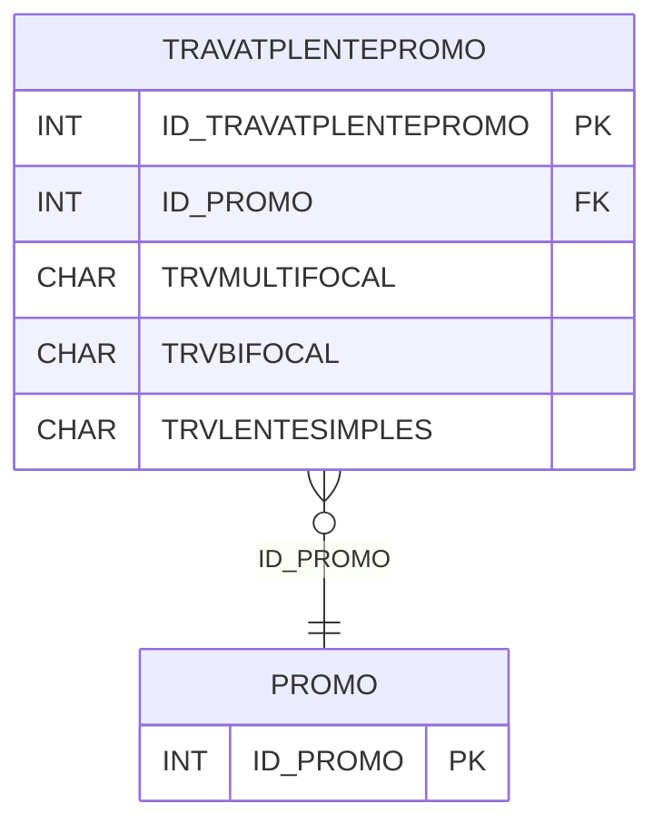

# TRAVATPLENTEPROMO - Documentação Completa de Relacionamentos

## 📊 Informações Gerais

- **Nome da Tabela**: TRAVATPLENTEPROMO (Trava Tipo Lente Promoção)
- **Total de Registros**: 68
- **Total de Colunas**: 16
- **Chave Primária**: ID_TRAVATPLENTEPROMO
- **Chaves Estrangeiras**: 1
- **Índices**: 0
- **Tabelas Dependentes**: 0
- **Banco de Dados**: Firebird

## 📝 Descrição

**TRAVATPLENTEPROMO** é uma tabela intermediária que armazena restrições de tipos de lente para promoções. Com **68 registros**, esta tabela registra quais tipos de lente são permitidos ou bloqueados em cada promoção, incluindo multifocal, bifocal, lente simples, blocos de visão, processos e características ópticas.

Esta tabela é essencial para:
- **Promoções**: Controlar tipos de lente em promoções
- **Restrições**: Aplicar restrições por tipo de lente
- **Rastreamento**: Rastrear restrições por promoção
- **Relatórios**: Gerar relatórios de restrições

---

## 🔑 Estrutura de Colunas

| Coluna | Tipo | Descrição |
|--------|------|-----------|
| **ID_TRAVATPLENTEPROMO** 🔑 | INT | Identificador único (PK) |
| **ID_PROMO** 🔗 | INT | Código da promoção (FK → PROMO) |
| **TRVMULTIFOCAL** | CHAR(1) | Permite multifocal |
| **TRVMULTIFOCALACABADO** | CHAR(1) | Permite multifocal acabado |
| **TRVBIFOCAL** | CHAR(1) | Permite bifocal |
| **TRVBIFOCALACABADO** | CHAR(1) | Permite bifocal acabado |
| **TRVLENTESIMPLES** | CHAR(1) | Permite lente simples |
| **TRVBLOCOVISAOSIMPLES** | CHAR(1) | Permite bloco visão simples |
| **TRVVISAOINTERMEDIA** | CHAR(1) | Permite visão intermediária |
| **TRVPROCCONVENCIONAL** | CHAR(1) | Permite processo convencional |
| **TRVPROCFREEFORM** | CHAR(1) | Permite processo freeform |
| **TRVESFERICO** | CHAR(1) | Permite esférico |
| **TRVCILINDRICO** | CHAR(1) | Permite cilíndrico |
| **TRVEIXO** | CHAR(1) | Permite eixo |
| **TRVADICAO** | CHAR(1) | Permite adição |
| **TRVDNP** | CHAR(1) | Permite DNP |

---

## 🔗 Relacionamentos - Nível 1 (Diretos)

### PROMO - Promoção (FK Obrigatória)
**Volume:** Variável

**Relacionamento:**
```
TRAVATPLENTEPROMO.ID_PROMO → PROMO.ID_PROMO (N:1)
Constraint: XFKTRVTPLPROMO_PROMO
```

---

## 🗺️ Diagrama de Relacionamentos



---

## 💡 Exemplos de Uso

### Consulta Básica

```sql
SELECT ID_TRAVATPLENTEPROMO, ID_PROMO, TRVMULTIFOCAL, TRVBIFOCAL, TRVLENTESIMPLES
FROM TRAVATPLENTEPROMO
WHERE ID_PROMO = ?;
```

### Consulta com Informações da Promoção

```sql
SELECT 
    t.*,
    p.PROMDESCRICAO
FROM TRAVATPLENTEPROMO t
INNER JOIN PROMO p
    ON t.ID_PROMO = p.ID_PROMO
WHERE t.ID_PROMO = ?;
```

---

## ⚡ Performance e Otimização

### Índices Recomendados

#### 1. Índice na Chave Primária (Já existe implicitamente)
```sql
-- Índice primário já existe implicitamente
```

#### 2. Índice em ID_PROMO
```sql
CREATE INDEX IDX_TRAVATPLENTEPROMO_PROMO 
ON TRAVATPLENTEPROMO (ID_PROMO);
```

**Justificativa:** Facilita buscas por promoção.

---

## 📊 Estatísticas e Insights

- **Total de Registros**: 68
- **Restrições**: 68 configurações de restrições por promoção

---

**Documentação gerada em**: 2025-01-27

**Banco de dados**: Firebird

