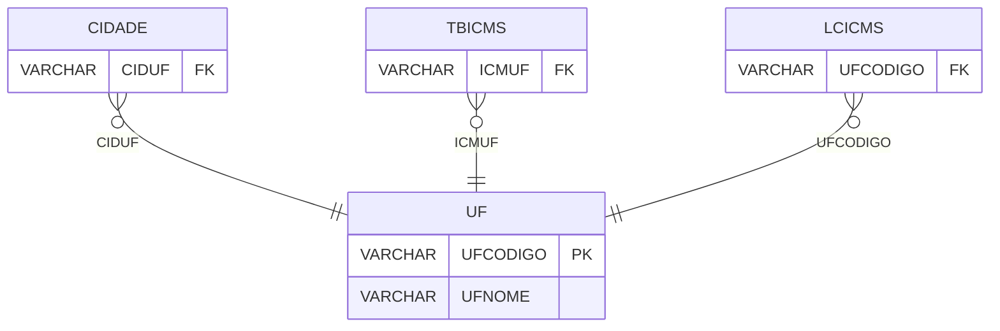

# UF - Documentação Completa de Relacionamentos

## 📊 Informações Gerais

- **Nome da Tabela**: UF (Unidade Federativa)
- **Total de Registros**: 26
- **Total de Colunas**: 2
- **Chave Primária**: UFCODIGO
- **Chaves Estrangeiras**: 0
- **Índices**: 0
- **Tabelas Dependentes**: 6
- **Banco de Dados**: Firebird

## 📝 Descrição

**UF** é uma tabela mestre que armazena informações sobre unidades federativas (estados) do Brasil. Com **26 registros**, esta tabela define todos os estados brasileiros, incluindo código e nome.

Esta tabela é essencial para:
- **Geografia**: Gerenciar unidades federativas
- **Endereços**: Validar endereços por UF
- **Fiscal**: Configurar regras fiscais por UF
- **Relatórios**: Gerar relatórios por UF

---

## 🔑 Estrutura de Colunas

| Coluna | Tipo | Descrição |
|--------|------|-----------|
| **UFCODIGO** 🔑 | VARCHAR(14) | Código da UF (PK) |
| **UFNOME** | VARCHAR(37) | Nome da UF |

---

## 📊 Tabelas que Referenciam Esta

Esta tabela é referenciada por 6 tabelas:

### CIDADE - Cidade
**Volume:** Variável

**Relacionamento:**
```
CIDADE.CIDUF → UF.UFCODIGO (N:1)
Constraint: UF_CIDADE
```

### TBICMS - Tabela ICMS
**Volume:** 1.216 registros

**Relacionamento:**
```
TBICMS.ICMUF → UF.UFCODIGO (N:1)
Constraint: UF_TBICMS
```

### LCICMS - Lançamento Contábil ICMS
**Volume:** Variável

**Relacionamento:**
```
LCICMS.UFCODIGO → UF.UFCODIGO (N:1)
Constraint: UF_LCICMS
```

### PROPAUTAICMSUB - Produto Pauta ICMS Substituição Tributária
**Volume:** Variável

**Relacionamento:**
```
PROPAUTAICMSUB.UFCODIGO → UF.UFCODIGO (N:1)
Constraint: FK_PROPAUTAICMSUB_UF
```

### PARTMEDICO - Participante Médico
**Volume:** Variável

**Relacionamento:**
```
PARTMEDICO.UFCODIGO → UF.UFCODIGO (N:1)
Constraint: UF_PARTMEDICO
```

### BLOCOE316 - Bloco E316
**Volume:** Variável

**Relacionamento:**
```
BLOCOE316.UF → UF.UFCODIGO (N:1)
Constraint: FK_BLOCOE316_1
```

---

## 🗺️ Diagrama de Relacionamentos



---

## 💡 Exemplos de Uso

### Consulta Básica

```sql
SELECT UFCODIGO, UFNOME
FROM UF
WHERE UFCODIGO = ?;
```

### Consulta com Cidades

```sql
SELECT 
    u.*,
    COUNT(c.CIDCODIGO) AS TOTAL_CIDADES
FROM UF u
LEFT JOIN CIDADE c
    ON u.UFCODIGO = c.CIDUF
GROUP BY u.UFCODIGO, u.UFNOME
ORDER BY u.UFNOME;
```

---

## ⚡ Performance e Otimização

### Índices Recomendados

#### 1. Índice na Chave Primária (Já existe implicitamente)
```sql
-- Índice primário já existe implicitamente
```

---

## 📊 Estatísticas e Insights

- **Total de Registros**: 26
- **UFs**: 26 unidades federativas cadastradas (26 estados + DF)

---

**Documentação gerada em**: 2025-01-27

**Banco de dados**: Firebird

