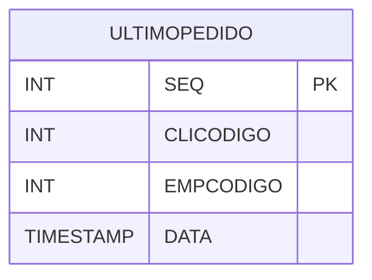

# ULTIMOPEDIDO - Documentação Completa de Relacionamentos

## 📊 Informações Gerais

- **Nome da Tabela**: ULTIMOPEDIDO (Último Pedido)
- **Total de Registros**: 4.108
- **Total de Colunas**: 4
- **Chave Primária**: SEQ
- **Chaves Estrangeiras**: 0
- **Índices**: 1
- **Tabelas Dependentes**: 0
- **Banco de Dados**: Firebird

## 📝 Descrição

**ULTIMOPEDIDO** é uma tabela que armazena informações sobre o último pedido realizado por cliente e empresa. Com **4.108 registros**, esta tabela registra a data do último pedido para cada combinação de cliente e empresa, permitindo análises de frequência de compras e relacionamento com clientes.

Esta tabela é essencial para:
- **Análise**: Analisar frequência de pedidos por cliente
- **Relacionamento**: Gerenciar relacionamento com clientes
- **Rastreamento**: Rastrear último pedido por cliente
- **Relatórios**: Gerar relatórios de relacionamento

---

## 🔑 Estrutura de Colunas

| Coluna | Tipo | Descrição |
|--------|------|-----------|
| **SEQ** 🔑 | INT | Sequencial único (PK) |
| **CLICODIGO** | INT | Código do cliente |
| **EMPCODIGO** | INT | Código da empresa |
| **DATA** | TIMESTAMP | Data do último pedido |

---

## 📇 Índices

| Nome do Índice | Colunas | Único |
|----------------|---------|-------|
| INDCLICODIGOEMPCODIGO | CLICODIGO, EMPCODIGO | Sim |

---

## 🗺️ Diagrama de Relacionamentos



---

## 💡 Exemplos de Uso

### Consulta Básica

```sql
SELECT SEQ, CLICODIGO, EMPCODIGO, DATA
FROM ULTIMOPEDIDO
WHERE CLICODIGO = ? AND EMPCODIGO = ?;
```

---

## ⚡ Performance e Otimização

### Índices Recomendados

#### 1. Índice na Chave Primária (Já existe implicitamente)
```sql
-- Índice primário já existe implicitamente
```

#### 2. Índice Existente
O índice composto em CLICODIGO e EMPCODIGO já está criado e é adequado.

---

## 📊 Estatísticas e Insights

- **Total de Registros**: 4.108
- **Clientes**: 4.108 combinações de cliente e empresa com histórico de pedidos

---

**Documentação gerada em**: 2025-01-27

**Banco de dados**: Firebird

