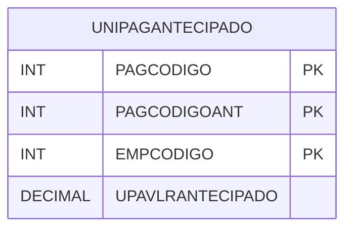

# UNIPAGANTECIPADO - Documentação Completa de Relacionamentos

## 📊 Informações Gerais

- **Nome da Tabela**: UNIPAGANTECIPADO (Unificação Pagar Antecipado)
- **Total de Registros**: 70
- **Total de Colunas**: 4
- **Chave Primária**: PAGCODIGO, PAGCODIGOANT, EMPCODIGO (composite)
- **Chaves Estrangeiras**: 0
- **Índices**: 0
- **Tabelas Dependentes**: 0
- **Banco de Dados**: Firebird

## 📝 Descrição

**UNIPAGANTECIPADO** é uma tabela intermediária que armazena informações sobre unificação de contas a pagar antecipadas. Com **70 registros**, esta tabela registra valores antecipados associados a contas a pagar, permitindo rastreamento de pagamentos antecipados.

Esta tabela é essencial para:
- **Unificação**: Gerenciar unificação de pagamentos antecipados
- **Rastreamento**: Rastrear valores antecipados
- **Relatórios**: Gerar relatórios de pagamentos antecipados

---

## 🔑 Estrutura de Colunas

| Coluna | Tipo | Descrição |
|--------|------|-----------|
| **PAGCODIGO** 🔑 | INT | Código da conta a pagar (PK) |
| **PAGCODIGOANT** 🔑 | INT | Código da conta a pagar antecipada (PK) |
| **EMPCODIGO** 🔑 | INT | Código da empresa (PK) |
| **UPAVLRANTECIPADO** | DECIMAL(18,2) | Valor antecipado |

---

## 🗺️ Diagrama de Relacionamentos



---

## 💡 Exemplos de Uso

### Consulta Básica

```sql
SELECT PAGCODIGO, PAGCODIGOANT, EMPCODIGO, UPAVLRANTECIPADO
FROM UNIPAGANTECIPADO
WHERE PAGCODIGO = ? AND EMPCODIGO = ?;
```

---

## ⚡ Performance e Otimização

### Índices Recomendados

#### 1. Índice Composto na Chave Primária (Já existe implicitamente)
```sql
-- Índice primário já existe implicitamente
```

---

## 📊 Estatísticas e Insights

- **Total de Registros**: 70
- **Unificações**: 70 unificações de pagamentos antecipados

---

**Documentação gerada em**: 2025-01-27

**Banco de dados**: Firebird

