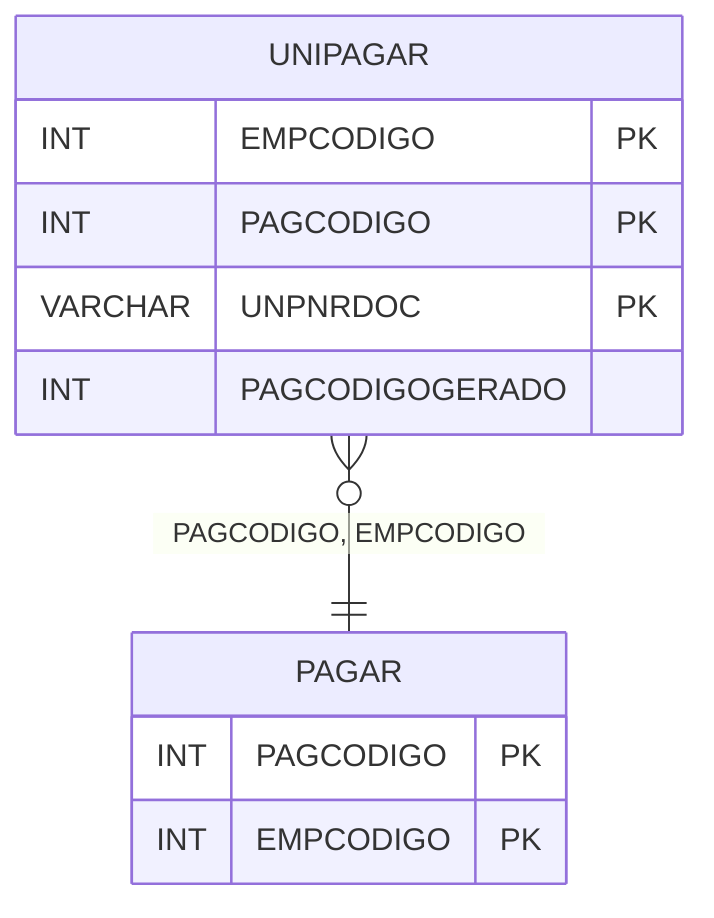

# UNIPAGAR - Documentação Completa de Relacionamentos

## 📊 Informações Gerais

- **Nome da Tabela**: UNIPAGAR (Unificação Pagar)
- **Total de Registros**: 118.620
- **Total de Colunas**: 4
- **Chave Primária**: EMPCODIGO, PAGCODIGO, UNPNRDOC (composite)
- **Chaves Estrangeiras**: 2
- **Índices**: 0
- **Tabelas Dependentes**: 0
- **Banco de Dados**: Firebird

## 📝 Descrição

**UNIPAGAR** é uma tabela intermediária de grande volume que armazena informações sobre unificação de contas a pagar. Com **118.620 registros**, esta tabela registra documentos unificados associados a contas a pagar, permitindo rastreamento de documentos gerados a partir de múltiplas contas.

Esta tabela é essencial para:
- **Unificação**: Gerenciar unificação de contas a pagar
- **Rastreamento**: Rastrear documentos gerados
- **Relatórios**: Gerar relatórios de unificação

---

## 🔑 Estrutura de Colunas

| Coluna | Tipo | Descrição |
|--------|------|-----------|
| **EMPCODIGO** 🔑 🔗 | INT | Código da empresa (PK, FK → PAGAR) |
| **PAGCODIGO** 🔑 🔗 | INT | Código da conta a pagar (PK, FK → PAGAR) |
| **UNPNRDOC** 🔑 | VARCHAR(14) | Número do documento unificado (PK) |
| **PAGCODIGOGERADO** | INT | Código da conta a pagar gerada |

---

## 🔗 Relacionamentos - Nível 1 (Diretos)

### PAGAR - Contas a Pagar (FK Obrigatória)
**Volume:** Variável

**Relacionamento:**
```
UNIPAGAR.PAGCODIGO → PAGAR.PAGCODIGO (N:1)
UNIPAGAR.EMPCODIGO → PAGAR.EMPCODIGO (N:1)
Constraint: PAGAR_UNIPAGAR
```

---

## 🗺️ Diagrama de Relacionamentos



---

## 💡 Exemplos de Uso

### Consulta Básica

```sql
SELECT EMPCODIGO, PAGCODIGO, UNPNRDOC, PAGCODIGOGERADO
FROM UNIPAGAR
WHERE EMPCODIGO = ? AND PAGCODIGO = ?;
```

---

## ⚡ Performance e Otimização

### Índices Recomendados

#### 1. Índice Composto na Chave Primária (Já existe implicitamente)
```sql
-- Índice primário já existe implicitamente
```

---

## 📊 Estatísticas e Insights

- **Total de Registros**: 118.620
- **Unificações**: 118.620 unificações de contas a pagar

---

**Documentação gerada em**: 2025-01-27

**Banco de dados**: Firebird

