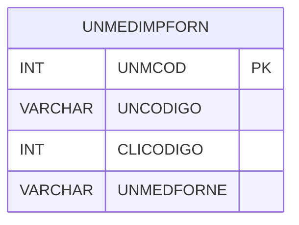

# UNMEDIMPFORN - Documentação Completa de Relacionamentos

## 📊 Informações Gerais

- **Nome da Tabela**: UNMEDIMPFORN (Unidade de Medida Importação Fornecedor)
- **Total de Registros**: 3
- **Total de Colunas**: 4
- **Chave Primária**: UNMCOD
- **Chaves Estrangeiras**: 0
- **Índices**: 1
- **Tabelas Dependentes**: 0
- **Banco de Dados**: Firebird

## 📝 Descrição

**UNMEDIMPFORN** é uma tabela de configuração que armazena informações sobre unidades de medida específicas para importação de fornecedores. Com apenas **3 registros**, esta tabela define unidades de medida utilizadas por fornecedores específicos durante importação de dados.

Esta tabela é essencial para:
- **Importação**: Gerenciar unidades de medida na importação
- **Fornecedores**: Associar unidades a fornecedores
- **Rastreamento**: Rastrear unidades por fornecedor

---

## 🔑 Estrutura de Colunas

| Coluna | Tipo | Descrição |
|--------|------|-----------|
| **UNMCOD** 🔑 | INT | Código único (PK) |
| **UNCODIGO** | VARCHAR(14) | Código da unidade de medida |
| **CLICODIGO** | INT | Código do cliente/fornecedor |
| **UNMEDFORNE** | VARCHAR(37) | Unidade de medida do fornecedor |

---

## 📇 Índices

| Nome do Índice | Colunas | Único |
|----------------|---------|-------|
| IND_UNMEDIMPFORN | UNCODIGO, CLICODIGO, UNMEDFORNE | Sim |

---

## 🗺️ Diagrama de Relacionamentos



---

## 💡 Exemplos de Uso

### Consulta Básica

```sql
SELECT UNMCOD, UNCODIGO, CLICODIGO, UNMEDFORNE
FROM UNMEDIMPFORN
WHERE CLICODIGO = ? AND UNCODIGO = ?;
```

---

## ⚡ Performance e Otimização

### Índices Recomendados

#### 1. Índice na Chave Primária (Já existe implicitamente)
```sql
-- Índice primário já existe implicitamente
```

#### 2. Índice Existente
O índice composto em UNCODIGO, CLICODIGO e UNMEDFORNE já está criado e é adequado.

---

## 📊 Estatísticas e Insights

- **Total de Registros**: 3
- **Mapeamentos**: 3 mapeamentos de unidades por fornecedor

---

**Documentação gerada em**: 2025-01-27

**Banco de dados**: Firebird

