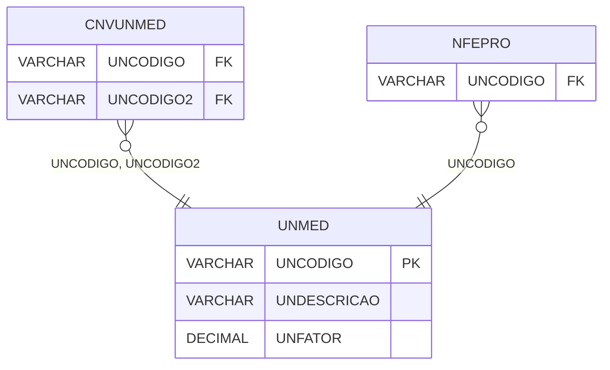

# UNMED - Documentação Completa de Relacionamentos

## 📊 Informações Gerais

- **Nome da Tabela**: UNMED (Unidade de Medida)
- **Total de Registros**: 130
- **Total de Colunas**: 3
- **Chave Primária**: UNCODIGO
- **Chaves Estrangeiras**: 0
- **Índices**: 0
- **Tabelas Dependentes**: 10
- **Banco de Dados**: Firebird

## 📝 Descrição

**UNMED** é uma tabela mestre que armazena informações sobre unidades de medida. Com **130 registros**, esta tabela define unidades de medida disponíveis no sistema, incluindo descrição e fator de conversão.

Esta tabela é essencial para:
- **Unidades**: Gerenciar unidades de medida
- **Conversão**: Facilitar conversão entre unidades
- **Rastreamento**: Rastrear unidades disponíveis
- **Relatórios**: Gerar relatórios de unidades

---

## 🔑 Estrutura de Colunas

| Coluna | Tipo | Descrição |
|--------|------|-----------|
| **UNCODIGO** 🔑 | VARCHAR(14) | Código da unidade de medida (PK) |
| **UNDESCRICAO** | VARCHAR(37) | Descrição da unidade |
| **UNFATOR** | DECIMAL(18,2) | Fator de conversão |

---

## 📊 Tabelas que Referenciam Esta

Esta tabela é referenciada por 10 tabelas, incluindo:

### CNVUNMED - Conversão Unidade de Medida
**Volume:** Variável

**Relacionamento:**
```
CNVUNMED.UNCODIGO → UNMED.UNCODIGO (N:1)
CNVUNMED.UNCODIGO2 → UNMED.UNCODIGO (N:1)
Constraint: UNMED_CNVUNMED, UNMED2_CNVUNMED
```

### NFEPRO - NFe Produto
**Volume:** Variável

**Relacionamento:**
```
NFEPRO.UNCODIGO → UNMED.UNCODIGO (N:1)
Constraint: UNMED_NFEPRO
```

### NFPRO - NF Produto
**Volume:** Variável

**Relacionamento:**
```
NFPRO.UNCODIGO → UNMED.UNCODIGO (N:1)
Constraint: UNMED_NFPRO
```

---

## 🗺️ Diagrama de Relacionamentos



---

## 💡 Exemplos de Uso

### Consulta Básica

```sql
SELECT UNCODIGO, UNDESCRICAO, UNFATOR
FROM UNMED
WHERE UNCODIGO = ?;
```

---

## ⚡ Performance e Otimização

### Índices Recomendados

#### 1. Índice na Chave Primária (Já existe implicitamente)
```sql
-- Índice primário já existe implicitamente
```

---

## 📊 Estatísticas e Insights

- **Total de Registros**: 130
- **Unidades**: 130 unidades de medida cadastradas

---

**Documentação gerada em**: 2025-01-27

**Banco de dados**: Firebird

