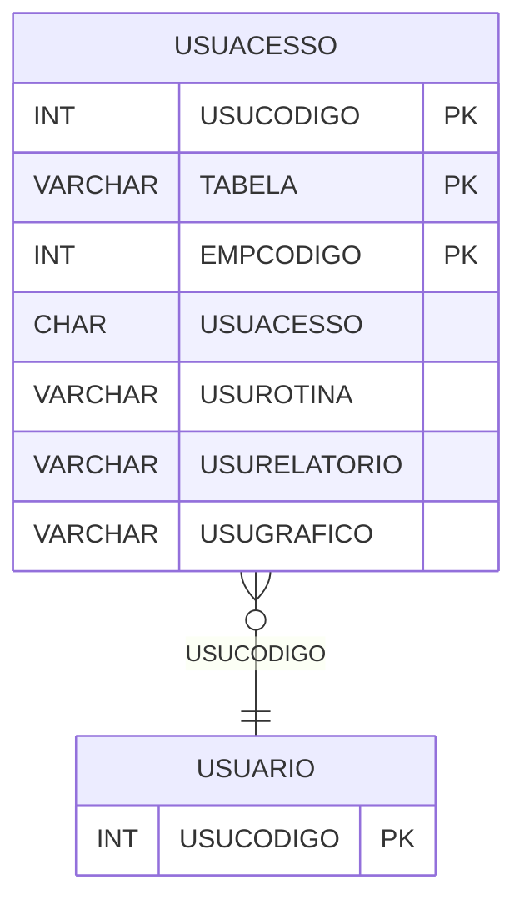

# USUACESSO - Documentação Completa de Relacionamentos

## 📊 Informações Gerais

- **Nome da Tabela**: USUACESSO (Usuário Acesso)
- **Total de Registros**: 68.197
- **Total de Colunas**: 7
- **Chave Primária**: USUCODIGO, TABELA, EMPCODIGO (composite)
- **Chaves Estrangeiras**: 1
- **Índices**: 0
- **Tabelas Dependentes**: 0
- **Banco de Dados**: Firebird

## 📝 Descrição

**USUACESSO** é uma tabela intermediária de grande volume que armazena permissões de acesso de usuários a tabelas, rotinas, relatórios e gráficos por empresa. Com **68.197 registros**, esta tabela registra quais usuários têm acesso a quais recursos do sistema em cada empresa.

Esta tabela é essencial para:
- **Permissões**: Gerenciar permissões de acesso por usuário
- **Segurança**: Controlar acesso a recursos do sistema
- **Rastreamento**: Rastrear permissões por usuário e empresa
- **Relatórios**: Gerar relatórios de permissões

---

## 🔑 Estrutura de Colunas

| Coluna | Tipo | Descrição |
|--------|------|-----------|
| **USUCODIGO** 🔑 🔗 | INT | Código do usuário (PK, FK → USUARIO) |
| **TABELA** 🔑 | VARCHAR(37) | Nome da tabela/recurso (PK) |
| **USUACESSO** | CHAR(1) | Tipo de acesso |
| **USUROTINA** | VARCHAR(37) | Nome da rotina |
| **USURELATORIO** | VARCHAR(37) | Nome do relatório |
| **USUGRAFICO** | VARCHAR(37) | Nome do gráfico |
| **EMPCODIGO** 🔑 | INT | Código da empresa (PK) |

---

## 🔗 Relacionamentos - Nível 1 (Diretos)

### USUARIO - Usuário (FK Obrigatória)
**Volume:** 297 registros

**Relacionamento:**
```
USUACESSO.USUCODIGO → USUARIO.USUCODIGO (N:1)
Constraint: USUARIO_USUACESSO
```

**Proporção:** ~229 permissões por usuário em média (68.197 / 297)

---

## 🗺️ Diagrama de Relacionamentos



---

## 💡 Exemplos de Uso

### Consulta Básica

```sql
SELECT USUCODIGO, TABELA, EMPCODIGO, USUACESSO, USUROTINA, USURELATORIO, USUGRAFICO
FROM USUACESSO
WHERE USUCODIGO = ? AND EMPCODIGO = ?;
```

---

## ⚡ Performance e Otimização

### Índices Recomendados

#### 1. Índice Composto na Chave Primária (Já existe implicitamente)
```sql
-- Índice primário já existe implicitamente
```

---

## 📊 Estatísticas e Insights

- **Total de Registros**: 68.197
- **Média por Usuário**: ~229 permissões por usuário

---

**Documentação gerada em**: 2025-01-27

**Banco de dados**: Firebird

