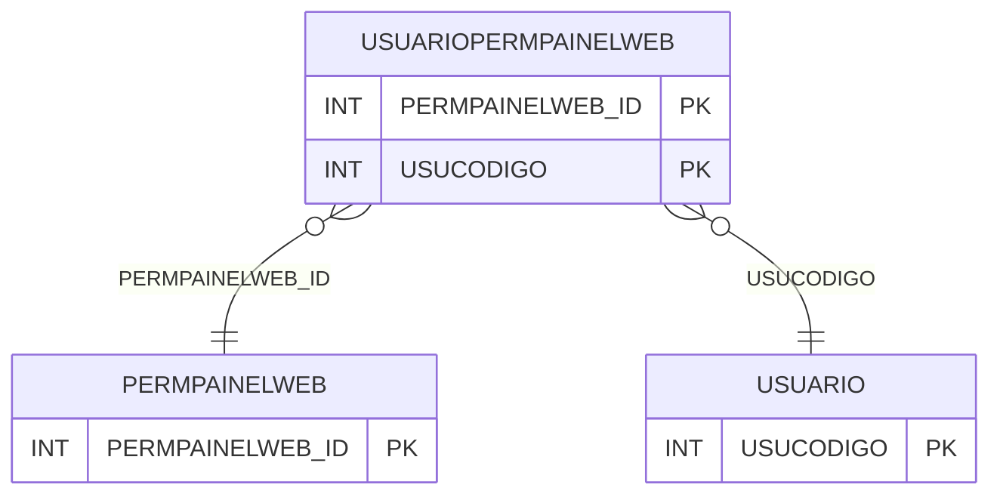

# USUARIOPERMPAINELWEB - Documentação Completa de Relacionamentos

## 📊 Informações Gerais

- **Nome da Tabela**: USUARIOPERMPAINELWEB (Usuário Permissão Painel Web)
- **Total de Registros**: 9
- **Total de Colunas**: 2
- **Chave Primária**: PERMPAINELWEB_ID, USUCODIGO (composite)
- **Chaves Estrangeiras**: 2
- **Índices**: 0
- **Tabelas Dependentes**: 0
- **Banco de Dados**: Firebird

## 📝 Descrição

**USUARIOPERMPAINELWEB** é uma tabela intermediária que associa usuários a permissões de painel web. Com apenas **9 registros**, esta tabela registra quais permissões de painel web cada usuário possui.

Esta tabela é essencial para:
- **Permissões Web**: Gerenciar permissões de painel web por usuário
- **Segurança**: Controlar acesso a recursos web
- **Rastreamento**: Rastrear permissões por usuário

---

## 🔑 Estrutura de Colunas

| Coluna | Tipo | Descrição |
|--------|------|-----------|
| **PERMPAINELWEB_ID** 🔑 🔗 | INT | ID da permissão do painel web (PK, FK → PERMPAINELWEB) |
| **USUCODIGO** 🔑 🔗 | INT | Código do usuário (PK, FK → USUARIO) |

---

## 🔗 Relacionamentos - Nível 1 (Diretos)

### PERMPAINELWEB - Permissão Painel Web (FK Obrigatória)
**Volume:** Variável

**Relacionamento:**
```
USUARIOPERMPAINELWEB.PERMPAINELWEB_ID → PERMPAINELWEB.PERMPAINELWEB_ID (N:1)
Constraint: PERMISSAO_PAINELWEB
```

### USUARIO - Usuário (FK Obrigatória)
**Volume:** 297 registros

**Relacionamento:**
```
USUARIOPERMPAINELWEB.USUCODIGO → USUARIO.USUCODIGO (N:1)
Constraint: USUARIO_PAINELWEB
```

---

## 🗺️ Diagrama de Relacionamentos



---

## 💡 Exemplos de Uso

### Consulta Básica

```sql
SELECT PERMPAINELWEB_ID, USUCODIGO
FROM USUARIOPERMPAINELWEB
WHERE USUCODIGO = ?;
```

---

## ⚡ Performance e Otimização

### Índices Recomendados

#### 1. Índice Composto na Chave Primária (Já existe implicitamente)
```sql
-- Índice primário já existe implicitamente
```

---

## 📊 Estatísticas e Insights

- **Total de Registros**: 9
- **Permissões**: 9 associações de permissões de painel web por usuário

---

**Documentação gerada em**: 2025-01-27

**Banco de dados**: Firebird

