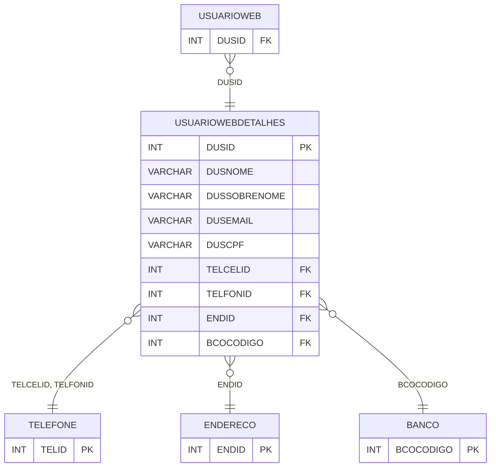

# USUARIOWEBDETALHES - Documentação Completa de Relacionamentos

## 📊 Informações Gerais

- **Nome da Tabela**: USUARIOWEBDETALHES (Usuário Web Detalhes)
- **Total de Registros**: 3.133
- **Total de Colunas**: 20
- **Chave Primária**: DUSID
- **Chaves Estrangeiras**: 4
- **Índices**: 1
- **Tabelas Dependentes**: 1
- **Banco de Dados**: Firebird

## 📝 Descrição

**USUARIOWEBDETALHES** é uma tabela intermediária que armazena informações detalhadas sobre usuários web. Com **3.133 registros**, esta tabela registra dados pessoais completos de usuários web, incluindo nome, sobrenome, data de nascimento, e-mail, CPF, RG, sexo, telefones, endereço, dados bancários e outras informações complementares.

Esta tabela é essencial para:
- **Perfis**: Armazenar perfis completos de usuários web
- **Dados Pessoais**: Gerenciar dados pessoais de usuários
- **Rastreamento**: Rastrear informações detalhadas por usuário
- **Relatórios**: Gerar relatórios de perfis de usuários

---

## 🔑 Estrutura de Colunas (Principais)

| Coluna | Tipo | Descrição |
|--------|------|-----------|
| **DUSID** 🔑 | INT | ID dos detalhes (PK) |
| **DUSNOME** | VARCHAR(37) | Nome |
| **DUSSOBRENOME** | VARCHAR(37) | Sobrenome |
| **DUSDTNASCIMENTO** | DATE | Data de nascimento |
| **DUSEMAIL** | VARCHAR(37) | E-mail |
| **DUSCPF** | VARCHAR(37) | CPF |
| **DUSRG** | VARCHAR(37) | RG |
| **DUSSEXO** | VARCHAR(37) | Sexo |
| **DUSMAE** | VARCHAR(37) | Nome da mãe |
| **TELCELID** 🔗 | INT | ID do telefone celular (FK → TELEFONE) |
| **TELFONID** 🔗 | INT | ID do telefone fixo (FK → TELEFONE) |
| **ENDID** 🔗 | INT | ID do endereço (FK → ENDERECO) |
| **BCOCODIGO** 🔗 | INT | Código do banco (FK → BANCO) |
| **DUSAGENCIA** | VARCHAR(37) | Agência bancária |
| **DUSCTCORRENTE** | VARCHAR(37) | Conta corrente |

---

## 🔗 Relacionamentos - Nível 1 (Diretos)

### TELEFONE - Telefone Celular (FK Opcional)
**Volume:** 4.760 registros

**Relacionamento:**
```
USUARIOWEBDETALHES.TELCELID → TELEFONE.TELID (N:1)
Constraint: TELEFONE_USUARIOWEBDETALHES_CEL
```

### TELEFONE - Telefone Fixo (FK Opcional)
**Volume:** 4.760 registros

**Relacionamento:**
```
USUARIOWEBDETALHES.TELFONID → TELEFONE.TELID (N:1)
Constraint: TELEFONE_USUARIOWEBDETALHES_FON
```

### ENDERECO - Endereço (FK Opcional)
**Volume:** Variável

**Relacionamento:**
```
USUARIOWEBDETALHES.ENDID → ENDERECO.ENDID (N:1)
Constraint: ENDERECO_USUARIOWEBDETALHES
```

### BANCO - Banco (FK Opcional)
**Volume:** Variável

**Relacionamento:**
```
USUARIOWEBDETALHES.BCOCODIGO → BANCO.BCOCODIGO (N:1)
Constraint: BCOCODIGO_DUS
```

---

## 📊 Tabelas que Referenciam Esta

Esta tabela é referenciada por 1 tabela:

### USUARIOWEB - Usuário Web
**Volume:** 7.366 registros

**Relacionamento:**
```
USUARIOWEB.DUSID → USUARIOWEBDETALHES.DUSID (N:1)
Constraint: USUARIOWEBDETALHES_USUARIOWEB
```

---

## 📇 Índices

| Nome do Índice | Colunas | Único |
|----------------|---------|-------|
| DUSNOME_USUARIOWEBDETALHES | DUSNOME | Não |

---

## 🗺️ Diagrama de Relacionamentos



---

## 💡 Exemplos de Uso

### Consulta Básica

```sql
SELECT DUSID, DUSNOME, DUSSOBRENOME, DUSEMAIL, DUSCPF, DUSRG
FROM USUARIOWEBDETALHES
WHERE DUSID = ?;
```

---

## ⚡ Performance e Otimização

### Índices Recomendados

#### 1. Índice na Chave Primária (Já existe implicitamente)
```sql
-- Índice primário já existe implicitamente
```

#### 2. Índice Existente
O índice em DUSNOME já está criado e é adequado.

---

## 📊 Estatísticas e Insights

- **Total de Registros**: 3.133
- **Detalhes**: 3.133 perfis detalhados de usuários web

---

**Documentação gerada em**: 2025-01-27

**Banco de dados**: Firebird

