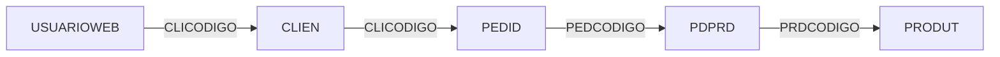
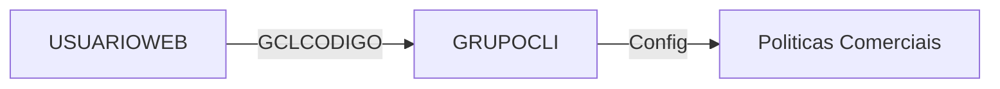
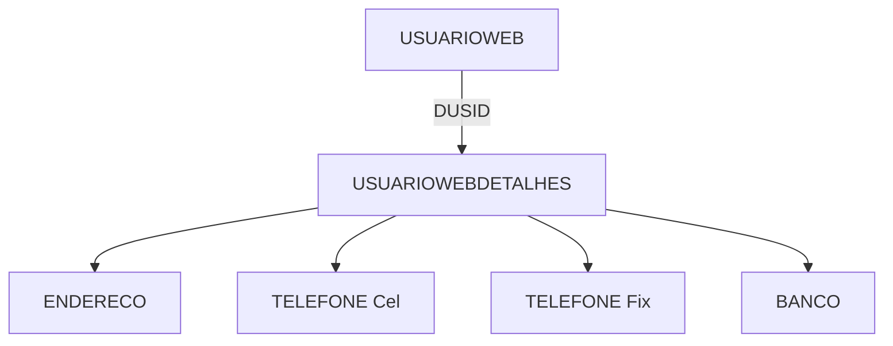
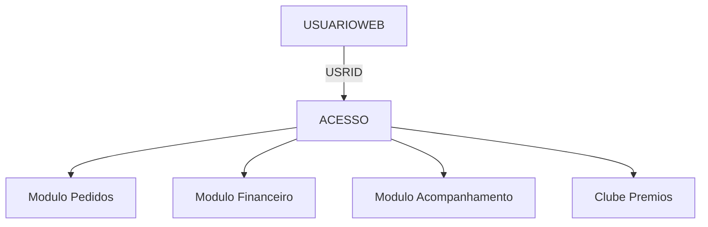
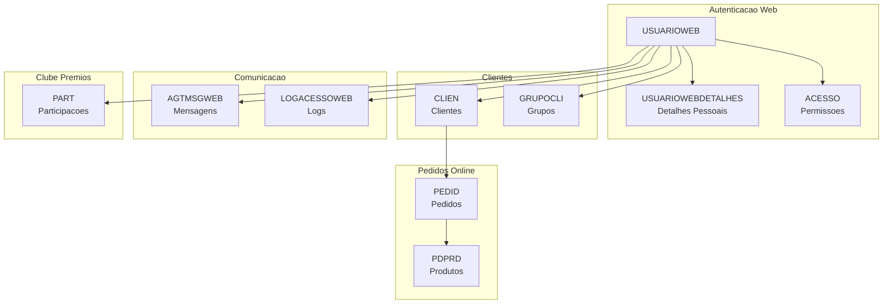
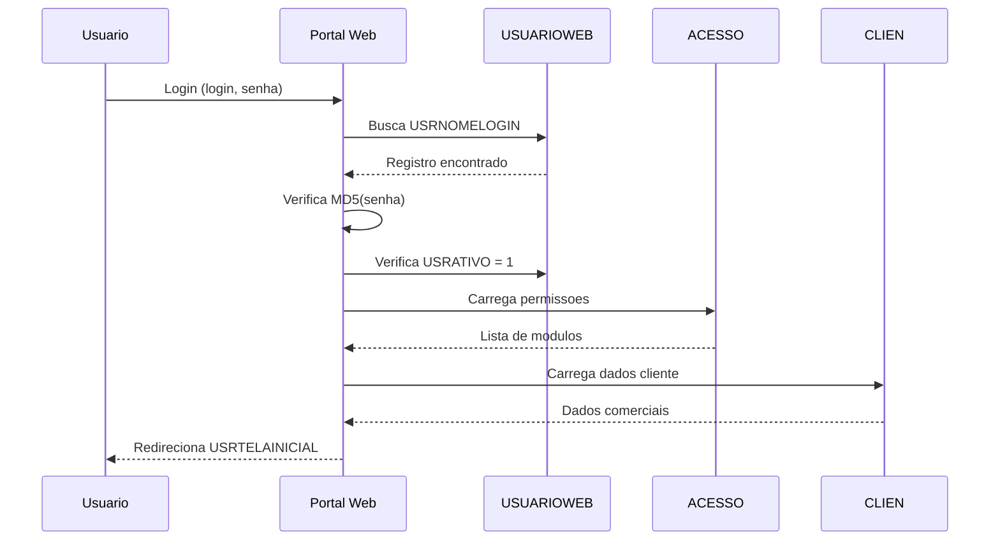

# USUARIOWEB - Usuarios do Portal Web - Relacionamentos Completos

> **Documentacao Tecnica Completa** - Tabela de usuarios do portal web/e-commerce
> **Ultima Atualizacao**: Novembro 2025

---

## Informacoes Gerais

| Propriedade | Valor |
|-------------|-------|
| **Nome da Tabela** | `USUARIOWEB` |
| **Banco de Dados** | Firebird 2.5 (Legado) |
| **Total de Registros** | 7.426 |
| **Usuarios Ativos** | 7.396 (99.6%) |
| **Usuarios Inativos** | 30 (0.4%) |
| **Com Vinculo Cliente** | 5.303 (71.4%) |
| **Com Email** | 1.368 (18.4%) |
| **Solicitantes de Pedido** | 186 (2.5%) |
| **Chave Primaria** | `USRID` (INTEGER) |
| **Data Criacao Mais Antiga** | 2015-09-22 |
| **Data Criacao Mais Recente** | 2025-11-28 |

---

## Descricao

### Proposito

A tabela `USUARIOWEB` e o **nucleo de autenticacao do portal web** da IndioLab. Ela gerencia:

1. **Clientes Online** - Acesso de clientes (oticas) ao portal de pedidos
2. **Sistema de Pedidos Web** - Interface para colocacao de pedidos online
3. **Clube de Premios** - Programa de fidelidade e recompensas
4. **Configuracoes Personalizadas** - Preferencias, favoritos, carrinho
5. **Integracao E-commerce** - Vinculo com clientes do sistema principal

### Quando e Usada

| Contexto | Descricao |
|----------|-----------|
| **Login Portal** | Autenticacao de clientes no portal web |
| **Pedidos Online** | Clientes fazendo pedidos via web |
| **Clube de Premios** | Programa de fidelidade |
| **Acompanhamento** | Cliente acompanha status de pedidos |
| **Financeiro** | Cliente visualiza boletos e financeiro |
| **Favoritos** | Produtos e configuracoes favoritas |

### Importancia no Sistema

```
ALTA - Nivel de Importancia: 8/10
```

- **Faturamento**: Portal responsavel por grande parte dos pedidos
- **Experiencia Cliente**: Interface principal de clientes
- **Programa Fidelidade**: Clube de premios vinculado
- **Operacional**: 7.400+ usuarios ativos

---

## Estrutura de Colunas

### Categoria: Identificacao

| Coluna | Tipo | Nulo | Descricao |
|--------|------|------|-----------|
| `USRID` | INTEGER | NOT NULL | **PK** - Codigo unico do usuario web |
| `USRNOMELOGIN` | VARCHAR(32) | NOT NULL | Login do usuario (UNIQUE) |
| `USRNOME` | VARCHAR(50) | NULL | Nome completo do usuario |
| `EMAIL` | VARCHAR(100) | NULL | Email do usuario |
| `USRTELEFONE` | VARCHAR(15) | NULL | Telefone de contato |
| `FOTO` | BLOB | NULL | Foto do usuario |

### Categoria: Autenticacao

| Coluna | Tipo | Nulo | Descricao |
|--------|------|------|-----------|
| `USRSENHA` | VARCHAR(256) | NOT NULL | Senha (MD5 hash - 32 chars) |
| `RESETSENHA` | CHAR(1) | NULL | Precisa resetar senha? (S/N) |
| `MFASECRET` | VARCHAR(128) | NULL | Secret para MFA (nao utilizado) |

### Categoria: Situacao e Nivel

| Coluna | Tipo | Nulo | Descricao |
|--------|------|------|-----------|
| `USRATIVO` | SMALLINT | NOT NULL | Ativo: 1=Sim, 0=Nao |
| `USRNIVEL` | INTEGER | NOT NULL | Nivel de acesso (0 ou 1) |
| `USRDTATIVACAO` | DATE | NULL | Data de ativacao |
| `USRDTCADASTRO` | DATE | NOT NULL | Data de cadastro |
| `USRDTULTIMOLOGIN` | DATE | NULL | Data ultimo login |

### Categoria: Vinculo com Cliente

| Coluna | Tipo | Nulo | Descricao |
|--------|------|------|-----------|
| `CLICODIGO` | INTEGER | NULL | **FK implicita** -> CLIEN.CLICODIGO |
| `GCLCODIGO` | INTEGER | NULL | **FK** -> GRUPOCLI.GCLCODIGO |

### Categoria: Detalhes Estendidos

| Coluna | Tipo | Nulo | Descricao |
|--------|------|------|-----------|
| `DUSID` | INTEGER | NULL | **FK** -> USUARIOWEBDETALHES.DUSID |

### Categoria: Configuracoes de Interface

| Coluna | Tipo | Nulo | Descricao |
|--------|------|------|-----------|
| `USRTELAINICIAL` | VARCHAR(64) | NOT NULL | Tela inicial apos login |
| `IDIOMASELECIONADO` | CHAR(2) | NULL | Idioma preferido |

### Categoria: Configuracoes de Pedido

| Coluna | Tipo | Nulo | Descricao |
|--------|------|------|-----------|
| `USRSOLPED` | CHAR(1) | NULL | Solicitante de pedido? (0/1) |
| `USRCODIGOLOGIN` | VARCHAR(15) | NULL | Codigo alternativo login |
| `FILTROSATACADO` | VARCHAR(255) | NULL | Filtros salvos (JSON) |

### Categoria: Persistencia de Dados

| Coluna | Tipo | Nulo | Descricao |
|--------|------|------|-----------|
| `CARRINHO` | BLOB | NULL | Carrinho de compras (JSON) |
| `IMPORTCARRINHO` | CHAR(1) | NULL | Importar carrinho? (S/N) |
| `FAVORITOS` | BLOB | NULL | Produtos favoritos (JSON) |
| `IMPORTFAVORITO` | CHAR(1) | NULL | Importar favoritos? (S/N) |

### Categoria: Empresa e Origem

| Coluna | Tipo | Nulo | Descricao |
|--------|------|------|-----------|
| `DUSEMPORIGEM` | CHAR(3) | NOT NULL | Empresa origem (M01) |

### Categoria: Termos e Consentimento

| Coluna | Tipo | Nulo | Descricao |
|--------|------|------|-----------|
| `ACEITETERMO` | CHAR(1) | NULL | Aceitou termos? (S/N) |
| `DATAACEITE` | TIMESTAMP | NULL | Data/hora do aceite |
| `IP` | VARCHAR(40) | NULL | IP do aceite |

### Categoria: Notificacoes

| Coluna | Tipo | Nulo | Descricao |
|--------|------|------|-----------|
| `NOTIFICACAOFINANCEIRA` | BLOB | NULL | Config notificacoes financeiras |
| `NOTIFICACAORELEASE` | VARCHAR(50) | NULL | Notificacao de releases |

### Categoria: Metricas

| Coluna | Tipo | Nulo | Descricao |
|--------|------|------|-----------|
| `USRQTDLOGIN` | SMALLINT | NULL | Quantidade de logins |

---

## Niveis de Acesso (USRNIVEL)

| Nivel | Descricao | Quantidade | Percentual |
|-------|-----------|------------|------------|
| `0` | Nivel basico | 3.354 | 45.2% |
| `1` | Nivel completo | 4.072 | 54.8% |

**Nota**: O nivel 1 geralmente indica usuarios com mais permissoes no portal.

---

## Telas Iniciais (USRTELAINICIAL)

| Tela | Usuarios | Percentual | Descricao |
|------|----------|------------|-----------|
| `WEBPEDIDOS` | 4.076 | 54.9% | Portal de pedidos |
| `clubedepremios-usuario` | 2.122 | 28.6% | Clube premios (usuario) |
| `clubedepremios` | 1.054 | 14.2% | Clube premios (geral) |
| (vazio) | 173 | 2.3% | Sem tela definida |
| `CLUBEDEPREMIOS` | 1 | 0.0% | Variacao maiuscula |

### Analise de Sistemas

```
WEBPEDIDOS (Portal):           4.076 [===================>             ] 54.9%
CLUBE DE PREMIOS:              3.177 [==============>                   ] 42.8%
OUTROS/NAO DEFINIDO:             173 [=>                                ]  2.3%
```

---

## Empresa de Origem (DUSEMPORIGEM)

| Empresa | Usuarios | Percentual |
|---------|----------|------------|
| `M01` | 7.426 | 100% |

**Nota**: Todos os usuarios sao da empresa M01 (matriz principal).

---

## Estatisticas de Uso

| Metrica | Valor |
|---------|-------|
| **Total Usuarios** | 7.426 |
| **Ativos** | 7.396 (99.6%) |
| **Ja Fizeram Login** | 5 (0.07%) |
| **Com Email** | 1.368 (18.4%) |
| **Solicitantes de Pedido** | 186 (2.5%) |
| **Aceitaram Termos** | 0 (0%) |

> **Observacao**: A baixa taxa de logins registrados (5) sugere que o campo `USRDTULTIMOLOGIN` nao esta sendo atualizado corretamente ou ha outro mecanismo de rastreamento.

---

## FK OUT - Tabelas que USUARIOWEB Referencia

### 1. GRUPOCLI (Grupos de Clientes)

```
USUARIOWEB.GCLCODIGO -> GRUPOCLI.GCLCODIGO
```

| Propriedade | Valor |
|-------------|-------|
| **Constraint** | `USUARIOWEB_GRUPOCLI` |
| **Tipo Relacao** | Muitos-para-Um |
| **Obrigatorio** | Nao |
| **Total Grupos** | 331 |

**Proposito**: Vincula o usuario web a um grupo de clientes para:
- Segmentacao de marketing
- Politicas de preco diferenciadas
- Campanhas direcionadas

### 2. USUARIOWEBDETALHES (Detalhes Estendidos)

```
USUARIOWEB.DUSID -> USUARIOWEBDETALHES.DUSID
```

| Propriedade | Valor |
|-------------|-------|
| **Constraint** | `USUARIOWEBDETALHES_USUARIOWEB` |
| **Tipo Relacao** | Um-para-Um |
| **Obrigatorio** | Nao |
| **Registros Detalhes** | 3.169 |

**Proposito**: Armazena informacoes pessoais detalhadas:
- Nome completo e sobrenome
- CPF e RG
- Data de nascimento
- Endereco
- Dados bancarios

### 3. CLIEN (Clientes - FK Implicita)

```
USUARIOWEB.CLICODIGO -> CLIEN.CLICODIGO
```

| Propriedade | Valor |
|-------------|-------|
| **Indice** | `USUARIOWEB_CLIENTE` |
| **Tipo Relacao** | Muitos-para-Um |
| **Usuarios Vinculados** | 5.303 (71.4%) |

**Proposito**: Vincula o usuario web ao cadastro de cliente no ERP:
- Acesso a historico de pedidos
- Limite de credito
- Condicoes comerciais

---

## FK IN - Tabelas que Referenciam USUARIOWEB

A tabela USUARIOWEB e referenciada por **6 tabelas** atraves de constraints formais.

| # | Tabela | Coluna FK | Constraint | Registros | Descricao |
|---|--------|-----------|------------|-----------|-----------|
| 1 | `ACESSO` | USRID | USUARIOWEB_ACESSO | 36.893 | Permissoes de acesso |
| 2 | `AGTMSGWEB` | USRID | USUARIOWEB_AGTMSGWEB | - | Mensagens agendadas |
| 3 | `LOGACESSOWEB` | USRID | USUARIOWEB_LOGACESSOWEB | 0 | Logs de acesso |
| 4 | `PART` | USRID | USUARIOWEB_PART | - | Participacoes |
| 5 | `USUARIOWEBEMPRESA` | USRID | USUARIOWEB_USUARIOWEBEMPRESA | 0 | Multi-empresa |
| 6 | `USUARIOWEBGRUPO` | USRID | USUARIOWEB_USUARIOWEBGRUPO | 0 | Grupos de usuarios |

---

## Tabela USUARIOWEBDETALHES (Relacionada 1:1)

### Estrutura

| Coluna | Tipo | Descricao |
|--------|------|-----------|
| `DUSID` | INTEGER | **PK** - Codigo |
| `DUSNOME` | VARCHAR(50) | Nome |
| `DUSSOBRENOME` | VARCHAR(64) | Sobrenome |
| `DUSEMAIL` | VARCHAR(64) | Email |
| `DUSDTNASCIMENTO` | DATE | Data nascimento |
| `DUSCPF` | VARCHAR(14) | CPF |
| `DUSRG` | VARCHAR(15) | RG |
| `DUSSEXO` | VARCHAR(1) | Sexo (M/F) |
| `DUSMAE` | VARCHAR(60) | Nome da mae |
| `ENDID` | INTEGER | FK -> Endereco |
| `TELCELID` | INTEGER | FK -> Telefone celular |
| `TELFONID` | INTEGER | FK -> Telefone fixo |
| `BCOCODIGO` | SMALLINT | Codigo banco |
| `DUSAGENCIA` | VARCHAR(5) | Agencia |
| `DUSCTCORRENTE` | VARCHAR(15) | Conta corrente |
| `DUSCTTIPO` | VARCHAR(1) | Tipo conta |
| `DUSCARTAO` | VARCHAR(30) | Cartao |
| `DUSREFCARTAO` | VARCHAR(30) | Referencia cartao |
| `DUSRECEBMSG` | INTEGER | Recebe mensagens? |
| `DUSEMPORIGEM` | CHAR(3) | Empresa origem |

### Estatisticas USUARIOWEBDETALHES

| Metrica | Valor |
|---------|-------|
| **Total Registros** | 3.169 |
| **Cobertura** | 42.7% dos usuarios |

---

## Tabela ACESSO (Permissoes Web)

### Estrutura

| Coluna | Tipo | Descricao |
|--------|------|-----------|
| `USRID` | INTEGER | FK -> USUARIOWEB |
| `MODID` | INTEGER | ID do modulo |
| `RECID` | INTEGER | ID do recurso |

### Estatisticas ACESSO

| Metrica | Valor |
|---------|-------|
| **Total Registros** | 36.893 |
| **Media por Usuario** | ~5 permissoes |

---

## Tabela GRUPOCLI (Grupos de Clientes)

### Estrutura

| Coluna | Tipo | Descricao |
|--------|------|-----------|
| `GCLCODIGO` | INTEGER | **PK** - Codigo |
| `GCLNOME` | VARCHAR(40) | Nome do grupo |
| `GCLSITCLI` | CHAR(1) | Verifica situacao cliente? |
| `GCLLMTCREDCLI` | CHAR(1) | Verifica limite credito? |
| `GCLDIASATRASCLI` | CHAR(1) | Verifica dias atraso? |
| `GCLDEMPENCLI` | CHAR(1) | Verifica demandas pendentes? |

### Exemplos de Grupos

| Codigo | Nome | Tipo |
|--------|------|------|
| 1-100 | Nomes de vendedores/representantes | Carteira |
| 101-200 | Nomes de cidades/regioes | Regional |
| 201-331 | Nomes de redes/franquias | Corporativo |

**Exemplos**: MARCIA, LEILA, GRUPO SHALON, OTICAS BRENO, OTICAS DINIZ, ESSILOR, VISOLUX

---

## Relacionamentos Nivel 2, 3 e 4+

### Fluxo 1: USUARIOWEB -> CLIEN -> PEDID



**Caminho**: Usuario Web -> Cliente -> Pedidos -> Produtos

### Fluxo 2: USUARIOWEB -> GRUPOCLI -> Politicas



### Fluxo 3: USUARIOWEB -> USUARIOWEBDETALHES -> Dados Pessoais



### Fluxo 4: USUARIOWEB -> ACESSO -> Modulos/Recursos



---

## Indices da Tabela

| Nome Indice | Coluna(s) | Unico | Proposito |
|-------------|-----------|-------|-----------|
| `XPKUSRID` | USRID | SIM | Chave primaria |
| `UNIQUE_USUARIOWEB_USRNOMELOGIN` | USRNOMELOGIN | SIM | Login unico |
| `USUARIOWEB_CLIENTE` | CLICODIGO | NAO | FK para CLIEN |
| `USUARIOWEB_GRUPOCLI` | GCLCODIGO | NAO | FK para GRUPOCLI |
| `USUARIOWEBDETALHES_USUARIOWEB` | DUSID | NAO | FK para detalhes |

---

## Clientes com Multiplos Usuarios

| Cliente | Total Usuarios | Descricao |
|---------|----------------|-----------|
| 1 | 49 | Cliente principal/interno |
| 7800 | 23 | Rede de lojas |
| 145 | 22 | Rede de lojas |
| 3 | 18 | Rede de lojas |
| 831 | 12 | Rede de lojas |
| 100 | 10 | Rede de lojas |
| 80 | 9 | Rede de lojas |
| 1099 | 9 | Rede de lojas |

**Padrao**: Redes de oticas maiores tendem a ter multiplos usuarios (funcionarios da rede).

---

## Casos de Uso - Queries Praticas

### 1. Listar Usuarios Web Ativos

```sql
SELECT USRID, USRNOMELOGIN, USRNOME, EMAIL, USRDTCADASTRO
FROM USUARIOWEB
WHERE USRATIVO = 1
ORDER BY USRNOME;
```

### 2. Usuarios por Tela Inicial

```sql
SELECT
    USRTELAINICIAL,
    COUNT(*) as total
FROM USUARIOWEB
WHERE USRATIVO = 1
GROUP BY USRTELAINICIAL
ORDER BY total DESC;
```

### 3. Usuarios do Portal de Pedidos

```sql
SELECT USRID, USRNOMELOGIN, USRNOME, CLICODIGO
FROM USUARIOWEB
WHERE USRTELAINICIAL = 'WEBPEDIDOS'
  AND USRATIVO = 1;
```

### 4. Usuarios do Clube de Premios

```sql
SELECT USRID, USRNOMELOGIN, USRNOME
FROM USUARIOWEB
WHERE USRTELAINICIAL LIKE '%clubedepremios%'
  AND USRATIVO = 1;
```

### 5. Usuarios com Vinculo de Cliente

```sql
SELECT
    uw.USRID,
    uw.USRNOMELOGIN,
    c.CLINOME as cliente
FROM USUARIOWEB uw
JOIN CLIEN c ON c.CLICODIGO = uw.CLICODIGO
WHERE uw.USRATIVO = 1
ORDER BY c.CLINOME;
```

### 6. Clientes com Mais Usuarios

```sql
SELECT
    uw.CLICODIGO,
    c.CLINOME,
    COUNT(*) as total_usuarios
FROM USUARIOWEB uw
JOIN CLIEN c ON c.CLICODIGO = uw.CLICODIGO
WHERE uw.USRATIVO = 1
GROUP BY uw.CLICODIGO, c.CLINOME
HAVING COUNT(*) > 1
ORDER BY total_usuarios DESC
ROWS 20;
```

### 7. Usuarios por Grupo de Cliente

```sql
SELECT
    g.GCLNOME as grupo,
    COUNT(uw.USRID) as usuarios
FROM GRUPOCLI g
LEFT JOIN USUARIOWEB uw ON uw.GCLCODIGO = g.GCLCODIGO
WHERE uw.USRATIVO = 1
GROUP BY g.GCLNOME
ORDER BY usuarios DESC
ROWS 20;
```

### 8. Usuarios com Detalhes Completos

```sql
SELECT
    uw.USRID,
    uw.USRNOMELOGIN,
    d.DUSNOME,
    d.DUSSOBRENOME,
    d.DUSEMAIL,
    d.DUSCPF
FROM USUARIOWEB uw
JOIN USUARIOWEBDETALHES d ON d.DUSID = uw.DUSID
WHERE uw.USRATIVO = 1;
```

### 9. Usuarios Sem Detalhes

```sql
SELECT
    uw.USRID,
    uw.USRNOMELOGIN,
    uw.USRNOME
FROM USUARIOWEB uw
LEFT JOIN USUARIOWEBDETALHES d ON d.DUSID = uw.DUSID
WHERE d.DUSID IS NULL
  AND uw.USRATIVO = 1;
```

### 10. Usuarios por Nivel de Acesso

```sql
SELECT
    USRNIVEL,
    COUNT(*) as total,
    ROUND(COUNT(*) * 100.0 / (SELECT COUNT(*) FROM USUARIOWEB), 2) as percentual
FROM USUARIOWEB
WHERE USRATIVO = 1
GROUP BY USRNIVEL;
```

### 11. Usuarios Cadastrados por Periodo

```sql
SELECT
    EXTRACT(YEAR FROM USRDTCADASTRO) as ano,
    EXTRACT(MONTH FROM USRDTCADASTRO) as mes,
    COUNT(*) as cadastros
FROM USUARIOWEB
GROUP BY EXTRACT(YEAR FROM USRDTCADASTRO), EXTRACT(MONTH FROM USRDTCADASTRO)
ORDER BY ano DESC, mes DESC
ROWS 24;
```

### 12. Usuarios Mais Recentes

```sql
SELECT FIRST 20
    USRID,
    USRNOMELOGIN,
    USRNOME,
    USRDTCADASTRO
FROM USUARIOWEB
ORDER BY USRDTCADASTRO DESC;
```

### 13. Usuarios Solicitantes de Pedido

```sql
SELECT USRID, USRNOMELOGIN, USRNOME, CLICODIGO
FROM USUARIOWEB
WHERE USRSOLPED = '1'
  AND USRATIVO = 1;
```

### 14. Usuarios com Carrinho Salvo

```sql
SELECT USRID, USRNOMELOGIN, CARRINHO
FROM USUARIOWEB
WHERE CARRINHO IS NOT NULL
  AND USRATIVO = 1;
```

### 15. Usuarios com Favoritos

```sql
SELECT USRID, USRNOMELOGIN, FAVORITOS
FROM USUARIOWEB
WHERE FAVORITOS IS NOT NULL
  AND USRATIVO = 1;
```

### 16. Permissoes de um Usuario Web

```sql
SELECT a.MODID, a.RECID
FROM ACESSO a
WHERE a.USRID = :usuario_id;
```

### 17. Usuarios por Quantidade de Permissoes

```sql
SELECT
    uw.USRID,
    uw.USRNOMELOGIN,
    COUNT(a.MODID) as total_permissoes
FROM USUARIOWEB uw
LEFT JOIN ACESSO a ON a.USRID = uw.USRID
WHERE uw.USRATIVO = 1
GROUP BY uw.USRID, uw.USRNOMELOGIN
ORDER BY total_permissoes DESC
ROWS 20;
```

### 18. Usuarios que Aceitaram Termos

```sql
SELECT USRID, USRNOMELOGIN, DATAACEITE, IP
FROM USUARIOWEB
WHERE ACEITETERMO = 'S';
```

### 19. Usuarios com Email Valido

```sql
SELECT USRID, USRNOMELOGIN, EMAIL
FROM USUARIOWEB
WHERE EMAIL IS NOT NULL
  AND EMAIL != ''
  AND EMAIL LIKE '%@%.%'
  AND USRATIVO = 1;
```

### 20. Relatorio Completo de Usuario Web

```sql
SELECT
    uw.USRID,
    uw.USRNOMELOGIN,
    uw.USRNOME,
    uw.EMAIL,
    uw.USRATIVO,
    uw.USRNIVEL,
    uw.USRTELAINICIAL,
    uw.USRDTCADASTRO,
    uw.USRDTULTIMOLOGIN,
    c.CLINOME as cliente,
    g.GCLNOME as grupo,
    d.DUSNOME as nome_completo,
    d.DUSCPF as cpf,
    (SELECT COUNT(*) FROM ACESSO a WHERE a.USRID = uw.USRID) as permissoes
FROM USUARIOWEB uw
LEFT JOIN CLIEN c ON c.CLICODIGO = uw.CLICODIGO
LEFT JOIN GRUPOCLI g ON g.GCLCODIGO = uw.GCLCODIGO
LEFT JOIN USUARIOWEBDETALHES d ON d.DUSID = uw.DUSID
WHERE uw.USRID = :usuario_id;
```

---

## Analises Estatisticas

### Evolucao de Cadastros

| Periodo | Cadastros Aproximados |
|---------|----------------------|
| 2015-2017 | ~1.500 |
| 2018-2020 | ~2.500 |
| 2021-2023 | ~2.500 |
| 2024-2025 | ~900+ |

### Distribuicao por Situacao

```
Ativos (1):   7.396 [==============================>  ] 99.6%
Inativos (0):    30 [                                 ]  0.4%
```

### Distribuicao por Sistema (Tela Inicial)

```
Portal Pedidos:     4.076 [===================>             ] 54.9%
Clube Premios:      3.177 [===============>                 ] 42.8%
Outros/Indefinido:    173 [>                                ]  2.3%
```

### Distribuicao por Nivel

```
Nivel 0 (Basico):   3.354 [=================>               ] 45.2%
Nivel 1 (Completo): 4.072 [===================>             ] 54.8%
```

### Cobertura de Dados

```
Com Cliente Vinculado: 5.303 [======================>          ] 71.4%
Com Detalhes:          3.169 [================>                ] 42.7%
Com Email:             1.368 [=======>                         ] 18.4%
Com Ultimo Login:          5 [                                 ]  0.1%
```

---

## Diagramas de Relacionamento

### Diagrama Geral - USUARIOWEB no Centro



### Diagrama de Fluxo de Login Web



---

## Sistemas do Portal

### 1. WEBPEDIDOS - Portal de Pedidos

**Usuarios**: 4.076 (54.9%)

**Funcionalidades**:
- Colocacao de pedidos online
- Acompanhamento de status
- Historico de pedidos
- Calculo de precos
- Selecao de produtos

### 2. Clube de Premios

**Usuarios**: 3.177 (42.8%)

**Telas**:
- `clubedepremios` - Visao geral/admin
- `clubedepremios-usuario` - Visao participante

**Funcionalidades**:
- Acumulo de pontos
- Resgate de premios
- Historico de pontuacao
- Catalogo de premios

---

## Consideracoes de Seguranca

### Senhas

- Armazenadas em MD5 (32 caracteres)
- Algoritmo considerado inseguro
- Recomendacao: Migrar para bcrypt/argon2

### MFA

- Campo `MFASECRET` existe mas nao utilizado
- Recomendacao: Implementar autenticacao 2FA

### Logs de Acesso

- Tabela `LOGACESSOWEB` vazia
- Recomendacao: Implementar auditoria de acessos

### Termos de Uso

- 0% de usuarios com aceite registrado
- Recomendacao: Implementar aceite obrigatorio

---

## Performance e Otimizacao

### Indices Existentes

Os indices atuais cobrem bem as operacoes principais:
- Busca por PK (USRID)
- Busca por login (USRNOMELOGIN - UNIQUE)
- Busca por cliente (CLICODIGO)
- Busca por grupo (GCLCODIGO)

### Indices Sugeridos

```sql
-- Para buscas por tela inicial
CREATE INDEX IDX_USUARIOWEB_TELAINICIAL ON USUARIOWEB (USRTELAINICIAL);

-- Para buscas por situacao
CREATE INDEX IDX_USUARIOWEB_ATIVO ON USUARIOWEB (USRATIVO);

-- Para buscas por data cadastro
CREATE INDEX IDX_USUARIOWEB_DTCADASTRO ON USUARIOWEB (USRDTCADASTRO);
```

---

## Integracao com Outros Sistemas

### E-commerce IndioLab

```
USUARIOWEB -> Portal Web -> API -> ERP (Firebird)
```

### Clube de Premios

```
USUARIOWEB -> Sistema Premios -> Pontuacao -> Resgates
```

### Aplicativo Mobile (se existente)

```
USUARIOWEB -> API -> App Mobile
```

---

## Observacoes Especiais

### Dados de Login

1. **USRDTULTIMOLOGIN**: Quase nao utilizado (5 registros)
2. **USRQTDLOGIN**: Contador de logins nao populado

### Integridade

1. **71.4%** dos usuarios tem vinculo com cliente (CLICODIGO)
2. **42.7%** tem detalhes completos (USUARIOWEBDETALHES)
3. **18.4%** tem email cadastrado

### Boas Praticas

1. **Sempre filtrar** por `USRATIVO = 1` para usuarios ativos
2. **Verificar USRTELAINICIAL** para entender contexto do usuario
3. **Considerar CLICODIGO** para operacoes de pedido

---

## Documentos Relacionados

| Documento | Descricao |
|-----------|-----------|
| `USUARIO_RELACIONAMENTOS_COMPLETOS.md` | Usuarios do sistema interno |
| `USUARIO_VS_USUARIOWEB_COMPARATIVO.md` | Comparativo entre sistemas |
| `CLIEN_RELACIONAMENTOS_COMPLETOS.md` | Clientes |
| `PEDID_RELACIONAMENTOS_COMPLETOS.md` | Pedidos |

---

## Changelog

| Data | Versao | Alteracao |
|------|--------|-----------|
| 2025-11-28 | 1.0 | Documentacao inicial completa |

---

**Autor**: Claude Code
**Revisao**: Equipe IndioLab
**Status**: Documentacao Oficial
