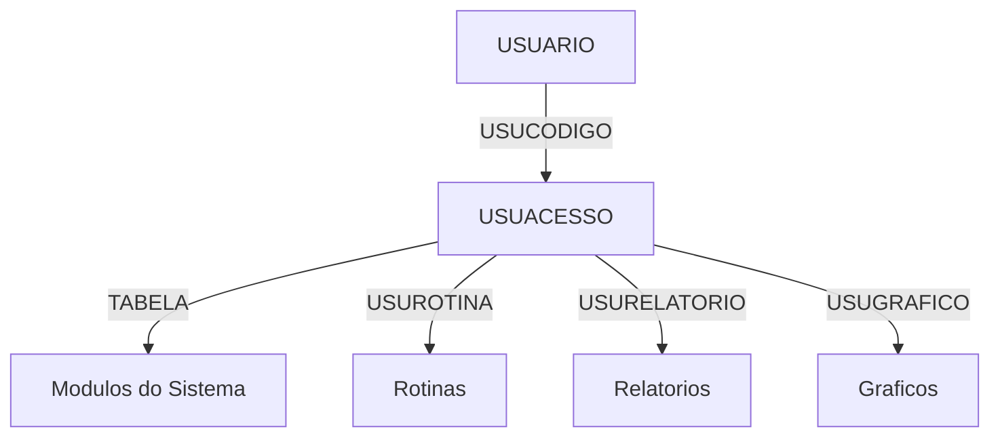
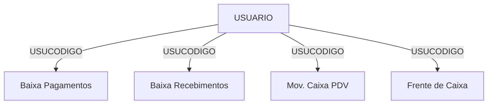
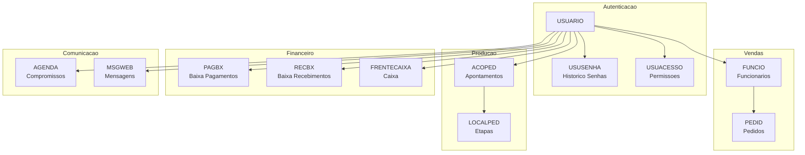
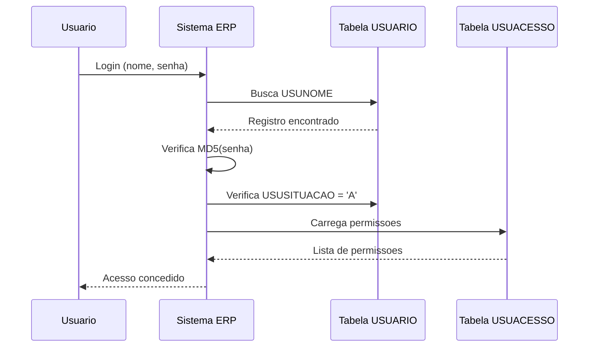

# USUARIO - Usuarios do Sistema Interno - Relacionamentos Completos

> **Documentacao Tecnica Completa** - Tabela de usuarios do sistema ERP interno
> **Ultima Atualizacao**: Novembro 2025

---

## Informacoes Gerais

| Propriedade | Valor |
|-------------|-------|
| **Nome da Tabela** | `USUARIO` |
| **Banco de Dados** | Firebird 2.5 (Legado) |
| **Total de Registros** | 300 |
| **Usuarios Ativos** | 172 (57.3%) |
| **Usuarios Inativos** | 128 (42.7%) |
| **Administradores** | 8 (2.7%) |
| **Vendedores Vinculados** | 226 (75.3%) |
| **Multi-Empresa** | 48 (16%) |
| **Chave Primaria** | `USUCODIGO` (SMALLINT) |
| **Data Criacao Mais Antiga** | 2003-06-11 |
| **Data Criacao Mais Recente** | 2025-11-17 |

---

## Descricao

### Proposito

A tabela `USUARIO` e o **nucleo central de autenticacao e autorizacao** do sistema ERP interno da IndioLab. Ela gerencia:

1. **Autenticacao de Funcionarios** - Login no sistema desktop/interno
2. **Controle de Acesso** - Permissoes por tabela, rotina e relatorio
3. **Rastreamento de Operacoes** - Auditoria de apontamentos de producao
4. **Vinculo com Vendedores** - Relacao usuario-funcionario para comissoes
5. **Configuracoes Pessoais** - Preferencias, empresa padrao, carrinho

### Quando e Usada

| Contexto | Descricao |
|----------|-----------|
| **Login Sistema** | Autenticacao de funcionarios no ERP |
| **Apontamentos (ACOPED)** | Registro de quem fez cada apontamento de producao |
| **Permissoes** | Controle de acesso a modulos, relatorios, graficos |
| **Vendas** | Vinculo com vendedor (FUNCIO) para pedidos |
| **Auditoria** | Rastreamento de acoes por usuario |
| **Movimentacoes Caixa** | Controle de quem fez baixas, recebimentos |

### Importancia no Sistema

```
CRITICA - Nivel de Importancia: 10/10
```

- **Seguranca**: Base de toda autenticacao do sistema ERP
- **Auditoria**: Vinculada a 30+ milhoes de apontamentos (ACOPED)
- **Permissoes**: 69.937 registros de permissoes (USUACESSO)
- **Operacional**: Sem usuario nao ha operacao no sistema

---

## Estrutura de Colunas

### Categoria: Identificacao

| Coluna | Tipo | Nulo | Descricao |
|--------|------|------|-----------|
| `USUCODIGO` | SMALLINT | NOT NULL | **PK** - Codigo unico do usuario |
| `USUNOME` | VARCHAR(20) | NOT NULL | Nome/login do usuario |
| `USUWEB` | VARCHAR(20) | NULL | Nome de usuario web (integracao) |
| `USUEMAIL` | VARCHAR(100) | NULL | Email do usuario |
| `USUTELEFONE` | VARCHAR(15) | NULL | Telefone de contato |
| `USUFOTO` | BLOB | NULL | Foto do usuario |

### Categoria: Autenticacao

| Coluna | Tipo | Nulo | Descricao |
|--------|------|------|-----------|
| `USUSENHA` | VARCHAR(256) | NULL | Senha (MD5 hash - 32 chars) |
| `USUDTALTSENHA` | TIMESTAMP | NULL | Data ultima alteracao de senha |
| `USUEXPIRA` | CHAR(1) | NULL | Senha expira? (S/N) |
| `USUDTEXPIRA` | TIMESTAMP | NULL | Data de expiracao da senha |
| `USUDIASEXPIRA` | SMALLINT | NULL | Dias para expirar senha |
| `USURESETSENHA` | CHAR(1) | NULL | Precisa resetar senha? (S/N) |
| `MFASECRET` | VARCHAR(128) | NULL | Secret para MFA (nao utilizado) |

### Categoria: Perfil e Situacao

| Coluna | Tipo | Nulo | Descricao |
|--------|------|------|-----------|
| `USUSITUACAO` | CHAR(1) | NOT NULL | Situacao: A=Ativo, I=Inativo |
| `USUADM` | CHAR(1) | NULL | Administrador? (S/N) |
| `USUTIPOREG` | CHAR(1) | NULL | Tipo: U=Usuario, P=Producao |
| `USUGRUPO` | SMALLINT | NULL | FK para outro USUARIO (grupo) |
| `USUAVISOLICENCA` | CHAR(1) | NOT NULL | Aviso de licenca? (S/N) |

### Categoria: Empresa e Multi-Tenant

| Coluna | Tipo | Nulo | Descricao |
|--------|------|------|-----------|
| `USUMULTIEMPRE` | CHAR(1) | NULL | Acesso multi-empresa? (S/N) |
| `USUEMPPADRAO` | SMALLINT | NULL | Empresa padrao do usuario |

### Categoria: Vinculo com Vendedor

| Coluna | Tipo | Nulo | Descricao |
|--------|------|------|-----------|
| `FUNCODIGO` | INTEGER | NULL | **FK** -> FUNCIO.FUNCODIGO |

### Categoria: Configuracoes Pessoais

| Coluna | Tipo | Nulo | Descricao |
|--------|------|------|-----------|
| `CARRINHO` | BLOB | NULL | Carrinho de compras salvo |
| `IMPORTCARRINHO` | CHAR(1) | NULL | Importar carrinho? (S/N) |
| `USUURLNOVIDADE` | VARCHAR(10000) | NULL | URL de novidades visualizadas |
| `USUDATANOVIDADE` | DATE | NULL | Data ultima novidade |
| `NOTIFICACAORELEASE` | VARCHAR(50) | NULL | Notificacao de releases |

### Categoria: Integracao MVDesk

| Coluna | Tipo | Nulo | Descricao |
|--------|------|------|-----------|
| `MVDESKID` | VARCHAR(64) | NULL | ID no MVDesk |
| `MVDESKUSUARIO` | VARCHAR(64) | NULL | Usuario no MVDesk |
| `MVDESKABRECHAMADO` | VARCHAR(1) | NULL | Pode abrir chamado? (S/N) |

### Categoria: Solicitacao de Pedidos

| Coluna | Tipo | Nulo | Descricao |
|--------|------|------|-----------|
| `USUSOLPED` | CHAR(1) | NULL | Solicita pedidos? (S/N) |
| `USUSOLPEDNOME` | VARCHAR(50) | NULL | Nome para solicitacao |
| `USUMOSTRABOLETO` | VARCHAR(1) | NULL | Mostra boleto? (S/N) |

### Categoria: Auditoria

| Coluna | Tipo | Nulo | Descricao |
|--------|------|------|-----------|
| `USUDTCAD` | TIMESTAMP | NOT NULL | Data de cadastro |

---

## Tipos de Registro (USUTIPOREG)

| Codigo | Descricao | Quantidade | Percentual |
|--------|-----------|------------|------------|
| `U` | Usuario Normal | 247 | 82.3% |
| `P` | Usuario de Producao | 53 | 17.7% |

**Usuarios de Producao** (`P`): Sao usuarios especificos para apontamentos em celulas de producao. Geralmente compartilhados em estacoes de trabalho.

---

## Distribuicao por Empresa Padrao

| Empresa | Usuarios | Descricao |
|---------|----------|-----------|
| 1 | 53 | Empresa principal |
| 7 | 29 | Filial/Unidade |
| 3 | 22 | Filial/Unidade |
| 6 | 6 | Filial/Unidade |
| 2 | 5 | Filial/Unidade |
| NULL | 185 | Sem empresa padrao |

---

## Analise de Senhas

| Metrica | Valor |
|---------|-------|
| **Senhas MD5 (32 chars)** | 272 (90.7%) |
| **Senhas Curtas** | 1 (0.3%) |
| **Sem Senha** | 27 (9%) |

> **IMPORTANTE**: As senhas sao armazenadas em hash MD5. Este e um algoritmo considerado inseguro para senhas modernas.

---

## FK OUT - Tabelas que USUARIO Referencia

### 1. FUNCIO (Funcionarios/Vendedores)

```
USUARIO.FUNCODIGO -> FUNCIO.FUNCODIGO
```

| Propriedade | Valor |
|-------------|-------|
| **Constraint** | `FUNCIO_USUARIO` |
| **Tipo Relacao** | Muitos-para-Um |
| **Obrigatorio** | Nao |
| **Usuarios Vinculados** | 226 (75.3%) |

**Proposito**: Vincula o usuario do sistema a um funcionario/vendedor. Usado para:
- Calcular comissoes de vendas
- Identificar vendedor em pedidos
- Controle de metas

### 2. USUARIO (Auto-Referencia - Grupo)

```
USUARIO.USUGRUPO -> USUARIO.USUCODIGO
```

| Propriedade | Valor |
|-------------|-------|
| **Constraint** | `USUARIO_USUGRUPO` |
| **Tipo Relacao** | Muitos-para-Um |
| **Obrigatorio** | Nao |

**Proposito**: Permite hierarquia de usuarios onde um usuario pode ser "subordinado" a outro (grupo).

---

## FK IN - Tabelas que Referenciam USUARIO

A tabela USUARIO e referenciada por **27 tabelas** atraves de constraints formais, alem de dezenas de referencias implicitas.

### Tabelas com FK Formal para USUARIO

| # | Tabela | Coluna FK | Constraint | Registros |
|---|--------|-----------|------------|-----------|
| 1 | `AGENDA` | USUCODIGO | USUARIO_AGENDA | - |
| 2 | `AGENDA` | USUCODREC | USUREC_AGENDA | - |
| 3 | `AGRECEB` | USUCODIGO | USUARIO_AGCLI | - |
| 4 | `AGRECEBP` | USUCODIGO | USUARIO_AGRECEBP | - |
| 5 | `CCORR` | USUCODIGO | USUARIO_CCORR | - |
| 6 | `CLPUSU` | USUCODIGO | USUARIO_CLPUSU | - |
| 7 | `FRENTECAIXA` | USUCODIGO | USUARIO_FRENTECAIXA | - |
| 8 | `LPEDUSU` | USUCODIGO | USUARIO_LPEDUSU | - |
| 9 | `MSGWEB` | USUCODIGO | USUARIO_MSGWEB | - |
| 10 | `PAGBX` | USUCODIGO | USUARIO_PAGBX | - |
| 11 | `PAGBXP` | USUCODIGO | USUARIO_PAGBXP | - |
| 12 | `PDVCAIXA` | USUCODIGO | USUARIO_PDVCAIXA | - |
| 13 | `PDVMOVCAIXA` | USUCODIGO | XFK_PDVMOVCAIXA_USUARIO | - |
| 14 | `PEDFOHISTOEXP` | USUCODIGO | USUARIO_PEDFOHISTOEXP | - |
| 15 | `PRECONFFISICA` | USUCODIGO | FKUSUARIO_PRECONFFISICA | - |
| 16 | `RECBX` | USUCODIGO | USUARIO_RECBX | - |
| 17 | `RECBXP` | USUCODIGO | USUARIO_RECBXP | - |
| 18 | `SITCLI` | USUCODIGO | USUARIO_SITCLI | - |
| 19 | `USUACESSO` | USUCODIGO | USUARIO_USUACESSO | 69.937 |
| 20 | `USUALMOX` | USUCODIGO | FK_USUALMOX_USUARIO | - |
| 21 | `USUARIO` | USUGRUPO | USUARIO_USUGRUPO | - |
| 22 | `USUARIOPERMPAINELWEB` | USUCODIGO | USUARIO_PAINELWEB | 9 |
| 23 | `USUCONTA` | USUCODIGO | USUARIO_USUCONTA | - |
| 24 | `USUINSTRUCAOSQL` | USUCODIGO | XFK_USUSQL_USU | - |
| 25 | `USUREMETENTEEMAIL` | USUCODIGO | USURE_USUARIO | - |
| 26 | `USUSENHA` | USUCODIGO | USUSENHA_USUARIO | 0 |
| 27 | `USUTBFIS` | USUCODIGO | FK_USUTBFIS_USUARIO | - |

### Tabelas com Referencia Implicita (USUCODIGO sem FK formal)

| # | Tabela | Descricao |
|---|--------|-----------|
| 1 | `ACOPED` | Acompanhamento de pedidos - 30M+ registros |
| 2 | `AGMAIL` | Agendamento de emails |
| 3 | `BALANCOCAIXASPRODU` | Balanco de caixas de producao |
| 4 | `FAVORITOS` | Favoritos do usuario |
| 5 | `HISTALTLIMCLIEN` | Historico alteracao limite cliente |
| 6 | `HISTIDPEDIDO` | Historico ID pedido |
| 7 | `MOVIMENTACAOCAIXAPRODU` | Movimentacao caixas producao |
| 8 | `MOVOCORRENCIA` | Movimentacao de ocorrencias |
| 9 | `PEDAPV` | Aprovacao de pedidos |
| 10 | `PEDSALVACERTIFICADO` | Certificados salvos |
| 11 | `PERMISSOES` | Permissoes adicionais |
| 12 | `RASTREAB` | Rastreabilidade |
| 13 | `RECREM` | Recebimento remessa |
| 14 | `RECREMP` | Recebimento remessa parcela |
| 15 | `REQPRO` | Requisicao producao |
| 16 | `RESERVAPEDIDO` | Reserva de pedidos |
| 17 | `USUNTSAC` | Notas SAC usuario |

---

## Relacionamentos Nivel 2, 3 e 4+

### Fluxo 1: USUARIO -> FUNCIO -> PEDID


**Caminho**: Usuario -> Vendedor -> Pedidos -> Produtos do Pedido -> Produtos

### Fluxo 2: USUARIO -> ACOPED -> PEDID -> CLIEN


**Caminho**: Usuario -> Apontamentos -> Pedidos -> Clientes

### Fluxo 3: USUARIO -> USUACESSO (Permissoes)



### Fluxo 4: USUARIO -> Movimentacoes Financeiras



---

## Sistema de Permissoes (USUACESSO)

### Estrutura da Tabela USUACESSO

| Coluna | Tipo | Descricao |
|--------|------|-----------|
| `USUCODIGO` | SMALLINT | FK -> USUARIO |
| `TABELA` | VARCHAR(30) | Modulo/Tabela do sistema |
| `USUACESSO` | CHAR(4) | Permissoes CRUD (GSSS/NNNN) |
| `USUROTINA` | VARCHAR(100) | Acesso a rotinas (S/N por posicao) |
| `USURELATORIO` | VARCHAR(60) | Acesso a relatorios |
| `USUGRAFICO` | VARCHAR(30) | Acesso a graficos |
| `EMPCODIGO` | SMALLINT | Empresa da permissao |

### Decodificacao de USUACESSO (4 caracteres)

| Posicao | Significado | Valores |
|---------|-------------|---------|
| 1 | Gravar (INSERT) | G=Sim, N=Nao |
| 2 | Salvar (UPDATE) | S=Sim, N=Nao |
| 3 | ??? | S=Sim, N=Nao |
| 4 | ??? | S=Sim, N=Nao |

### Usuarios com Mais Permissoes

| Usuario | Nome | Total Permissoes |
|---------|------|------------------|
| 3 | ATENDIMENTO | 1.248 |
| 155 | - | 949 |
| 77 | - | 887 |
| 218 | - | 856 |
| 8 | - | 849 |
| 145 | - | 832 |
| 246 | - | 782 |
| 257 | - | 765 |
| 240 | - | 749 |
| 206 | - | 735 |

### Estatisticas USUACESSO

| Metrica | Valor |
|---------|-------|
| **Total de Registros** | 69.937 |
| **Media por Usuario** | ~233 permissoes |
| **Usuarios com Permissoes** | ~300 |

---

## Indices da Tabela

| Nome Indice | Coluna(s) | Unico | Proposito |
|-------------|-----------|-------|-----------|
| `XPKUSUARIO` | USUCODIGO | SIM | Chave primaria |
| `FUNCIO_USUARIO` | FUNCODIGO | NAO | FK para FUNCIO |
| `USUARIO_USUGRUPO` | USUGRUPO | NAO | Auto-referencia grupo |

---

## Casos de Uso - Queries Praticas

### 1. Listar Usuarios Ativos

```sql
SELECT USUCODIGO, USUNOME, USUDTCAD, USUTIPOREG
FROM USUARIO
WHERE USUSITUACAO = 'A'
ORDER BY USUNOME;
```

### 2. Usuarios Administradores

```sql
SELECT USUCODIGO, USUNOME, USUDTCAD
FROM USUARIO
WHERE USUADM = 'S'
  AND USUSITUACAO = 'A';
```

### 3. Usuarios com Vinculo de Vendedor

```sql
SELECT u.USUCODIGO, u.USUNOME, f.FUNNOME as vendedor
FROM USUARIO u
JOIN FUNCIO f ON f.FUNCODIGO = u.FUNCODIGO
WHERE u.USUSITUACAO = 'A';
```

### 4. Usuarios Multi-Empresa

```sql
SELECT USUCODIGO, USUNOME, USUEMPPADRAO
FROM USUARIO
WHERE USUMULTIEMPRE = 'S'
  AND USUSITUACAO = 'A';
```

### 5. Usuarios por Tipo de Registro

```sql
SELECT
    USUTIPOREG,
    COUNT(*) as total,
    COUNT(CASE WHEN USUSITUACAO = 'A' THEN 1 END) as ativos
FROM USUARIO
GROUP BY USUTIPOREG;
```

### 6. Usuarios por Empresa Padrao

```sql
SELECT
    USUEMPPADRAO,
    COUNT(*) as total_usuarios
FROM USUARIO
WHERE USUEMPPADRAO IS NOT NULL
GROUP BY USUEMPPADRAO
ORDER BY total_usuarios DESC;
```

### 7. Usuarios que Nunca Alteraram Senha

```sql
SELECT USUCODIGO, USUNOME, USUDTCAD
FROM USUARIO
WHERE USUDTALTSENHA IS NULL
  AND USUSITUACAO = 'A';
```

### 8. Usuarios com Senha Expirando

```sql
SELECT USUCODIGO, USUNOME, USUDTEXPIRA
FROM USUARIO
WHERE USUEXPIRA = 'S'
  AND USUDTEXPIRA <= CURRENT_DATE + 30
  AND USUSITUACAO = 'A';
```

### 9. Top 10 Usuarios Mais Ativos (por Apontamentos)

```sql
SELECT FIRST 10
    u.USUCODIGO,
    u.USUNOME,
    COUNT(a.ACOCODIGO) as total_apontamentos
FROM USUARIO u
JOIN ACOPED a ON a.USUCODIGO = u.USUCODIGO
WHERE a.ACODATA >= CURRENT_DATE - 30
GROUP BY u.USUCODIGO, u.USUNOME
ORDER BY total_apontamentos DESC;
```

### 10. Usuarios Inativos Recentemente

```sql
SELECT USUCODIGO, USUNOME, USUDTCAD
FROM USUARIO
WHERE USUSITUACAO = 'I'
ORDER BY USUDTCAD DESC
ROWS 20;
```

### 11. Permissoes de um Usuario Especifico

```sql
SELECT TABELA, USUACESSO, USUROTINA
FROM USUACESSO
WHERE USUCODIGO = :codigo_usuario
  AND EMPCODIGO = :empresa
ORDER BY TABELA;
```

### 12. Usuarios com Acesso a um Modulo

```sql
SELECT u.USUCODIGO, u.USUNOME, ua.USUACESSO
FROM USUARIO u
JOIN USUACESSO ua ON ua.USUCODIGO = u.USUCODIGO
WHERE ua.TABELA = 'PEDID'
  AND ua.USUACESSO NOT LIKE 'NNNN'
  AND u.USUSITUACAO = 'A';
```

### 13. Usuarios por Quantidade de Permissoes

```sql
SELECT
    u.USUCODIGO,
    u.USUNOME,
    COUNT(ua.TABELA) as total_permissoes
FROM USUARIO u
LEFT JOIN USUACESSO ua ON ua.USUCODIGO = u.USUCODIGO
WHERE u.USUSITUACAO = 'A'
GROUP BY u.USUCODIGO, u.USUNOME
ORDER BY total_permissoes DESC
ROWS 20;
```

### 14. Usuarios de Producao por Celula (via ACOPED)

```sql
SELECT DISTINCT
    u.USUCODIGO,
    u.USUNOME,
    a.ALXCODIGO as celula,
    COUNT(*) as apontamentos
FROM USUARIO u
JOIN ACOPED a ON a.USUCODIGO = u.USUCODIGO
WHERE u.USUTIPOREG = 'P'
  AND a.ACODATA >= CURRENT_DATE - 7
GROUP BY u.USUCODIGO, u.USUNOME, a.ALXCODIGO
ORDER BY celula, apontamentos DESC;
```

### 15. Vendedores com seus Usuarios

```sql
SELECT
    f.FUNCODIGO,
    f.FUNNOME as vendedor,
    u.USUCODIGO,
    u.USUNOME as usuario_sistema
FROM FUNCIO f
LEFT JOIN USUARIO u ON u.FUNCODIGO = f.FUNCODIGO
WHERE f.FUNVENDEDOR = 'S'
ORDER BY f.FUNNOME;
```

### 16. Usuarios Cadastrados por Periodo

```sql
SELECT
    EXTRACT(YEAR FROM USUDTCAD) as ano,
    EXTRACT(MONTH FROM USUDTCAD) as mes,
    COUNT(*) as cadastros
FROM USUARIO
WHERE USUDTCAD IS NOT NULL
GROUP BY EXTRACT(YEAR FROM USUDTCAD), EXTRACT(MONTH FROM USUDTCAD)
ORDER BY ano DESC, mes DESC
ROWS 24;
```

### 17. Usuarios com Painel Web

```sql
SELECT u.USUCODIGO, u.USUNOME, p.PERMPAINELWEB_ID
FROM USUARIO u
JOIN USUARIOPERMPAINELWEB p ON p.USUCODIGO = u.USUCODIGO
WHERE u.USUSITUACAO = 'A';
```

### 18. Apontamentos por Usuario Hoje

```sql
SELECT
    u.USUCODIGO,
    u.USUNOME,
    COUNT(*) as apontamentos_hoje
FROM USUARIO u
JOIN ACOPED a ON a.USUCODIGO = u.USUCODIGO
WHERE a.ACODATA = CURRENT_DATE
GROUP BY u.USUCODIGO, u.USUNOME
ORDER BY apontamentos_hoje DESC;
```

### 19. Usuarios sem Permissoes

```sql
SELECT u.USUCODIGO, u.USUNOME
FROM USUARIO u
LEFT JOIN USUACESSO ua ON ua.USUCODIGO = u.USUCODIGO
WHERE ua.USUCODIGO IS NULL
  AND u.USUSITUACAO = 'A';
```

### 20. Relatorio Completo de Usuario

```sql
SELECT
    u.USUCODIGO,
    u.USUNOME,
    u.USUSITUACAO,
    u.USUADM,
    u.USUTIPOREG,
    u.USUMULTIEMPRE,
    u.USUEMPPADRAO,
    u.USUDTCAD,
    f.FUNNOME as vendedor,
    (SELECT COUNT(*) FROM USUACESSO ua WHERE ua.USUCODIGO = u.USUCODIGO) as total_permissoes
FROM USUARIO u
LEFT JOIN FUNCIO f ON f.FUNCODIGO = u.FUNCODIGO
WHERE u.USUCODIGO = :codigo_usuario;
```

---

## Analises Estatisticas

### Evolucao de Cadastros

| Periodo | Cadastros |
|---------|-----------|
| 2003 (fundacao) | 2 |
| 2015-2019 | ~200 |
| 2020-2024 | ~80 |
| 2025 (ate Nov) | ~18 |

### Distribuicao por Situacao

```
Ativos (A):   172 [=================>                ] 57.3%
Inativos (I): 128 [============>                     ] 42.7%
```

### Distribuicao por Tipo

```
Usuario (U):  247 [==========================>       ] 82.3%
Producao (P):  53 [======>                           ] 17.7%
```

### Distribuicao por Perfil Admin

```
Admin (S):     8 [=>                                ] 2.7%
Normal (N): 292 [===============================>  ] 97.3%
```

---

## Diagramas de Relacionamento

### Diagrama Geral - USUARIO no Centro



### Diagrama de Fluxo de Autenticacao



---

## Performance e Otimizacao

### Indices Recomendados

Os indices existentes sao adequados para as operacoes principais:

| Indice | Cobertura |
|--------|-----------|
| `XPKUSUARIO` | Buscas por PK |
| `FUNCIO_USUARIO` | JOINs com FUNCIO |
| `USUARIO_USUGRUPO` | Hierarquia de grupos |

### Indices Sugeridos (nao existentes)

```sql
-- Para buscas por situacao
CREATE INDEX IDX_USUARIO_SITUACAO ON USUARIO (USUSITUACAO);

-- Para buscas por nome
CREATE INDEX IDX_USUARIO_NOME ON USUARIO (USUNOME);

-- Para buscas por empresa
CREATE INDEX IDX_USUARIO_EMPRESA ON USUARIO (USUEMPPADRAO);
```

### Consideracoes de Performance

1. **ACOPED**: 30+ milhoes de registros referenciam USUARIO - JOINs podem ser lentos
2. **USUACESSO**: 70k registros - usar indices em buscas
3. **Cache**: Recomenda-se cache de permissoes em memoria

---

## Observacoes Especiais

### Seguranca

1. **Senhas MD5**: Algoritmo considerado inseguro. Recomenda-se migracao para bcrypt/argon2
2. **MFA**: Campo `MFASECRET` existe mas nao e utilizado
3. **Historico de Senhas**: Tabela `USUSENHA` vazia - nao ha politica de historico

### Integridade

1. **Usuarios de Producao**: Podem ser compartilhados entre operadores
2. **Vinculo FUNCIO**: 75% dos usuarios tem vinculo - importante para vendas
3. **Multi-Empresa**: Apenas 16% tem acesso multi-empresa

### Boas Praticas

1. **Sempre filtrar** por `USUSITUACAO = 'A'` ao listar usuarios ativos
2. **Verificar USUTIPOREG** ao analisar comportamento (U vs P)
3. **Considerar USUEMPPADRAO** em ambientes multi-tenant

---

## Documentos Relacionados

| Documento | Descricao |
|-----------|-----------|
| `USUARIOWEB_RELACIONAMENTOS_COMPLETOS.md` | Usuarios do portal web |
| `USUARIO_VS_USUARIOWEB_COMPARATIVO.md` | Comparativo entre sistemas |
| `ACOPED_RELACIONAMENTOS_COMPLETOS.md` | Apontamentos de producao |
| `PEDID_RELACIONAMENTOS_COMPLETOS.md` | Pedidos |
| `FUNCIO_RELACIONAMENTOS_COMPLETOS.md` | Funcionarios |

---

## Changelog

| Data | Versao | Alteracao |
|------|--------|-----------|
| 2025-11-28 | 1.0 | Documentacao inicial completa |

---

**Autor**: Claude Code
**Revisao**: Equipe IndioLab
**Status**: Documentacao Oficial
