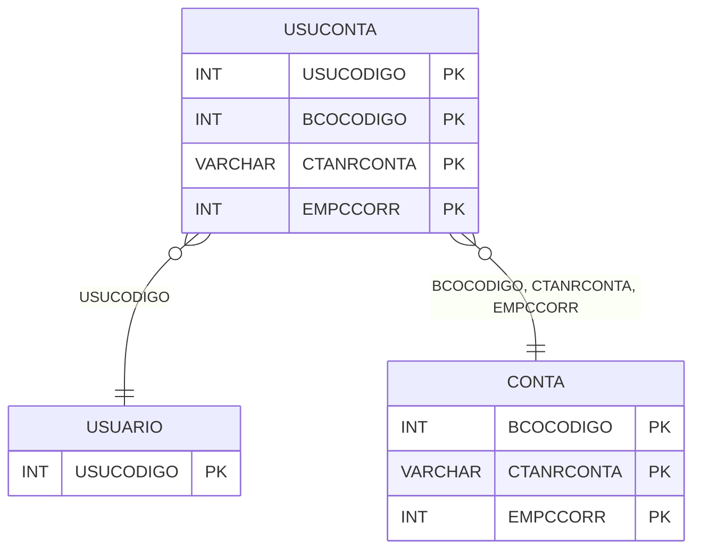

# USUCONTA - Documentação Completa de Relacionamentos

## 📊 Informações Gerais

- **Nome da Tabela**: USUCONTA (Usuário Conta)
- **Total de Registros**: 248
- **Total de Colunas**: 4
- **Chave Primária**: USUCODIGO, BCOCODIGO, CTANRCONTA, EMPCCORR (composite)
- **Chaves Estrangeiras**: 4
- **Índices**: 0
- **Tabelas Dependentes**: 0
- **Banco de Dados**: Firebird

## 📝 Descrição

**USUCONTA** é uma tabela intermediária que associa usuários a contas bancárias. Com **248 registros**, esta tabela registra quais contas bancárias cada usuário tem acesso ou está associado.

Esta tabela é essencial para:
- **Contas**: Gerenciar contas bancárias por usuário
- **Permissões**: Controlar acesso a contas
- **Rastreamento**: Rastrear contas por usuário
- **Relatórios**: Gerar relatórios de contas por usuário

---

## 🔑 Estrutura de Colunas

| Coluna | Tipo | Descrição |
|--------|------|-----------|
| **USUCODIGO** 🔑 🔗 | INT | Código do usuário (PK, FK → USUARIO) |
| **BCOCODIGO** 🔑 🔗 | INT | Código do banco (PK, FK → CONTA) |
| **CTANRCONTA** 🔑 🔗 | VARCHAR(37) | Número da conta (PK, FK → CONTA) |
| **EMPCCORR** 🔑 🔗 | INT | Código da empresa/centro de custo (PK, FK → CONTA) |

---

## 🔗 Relacionamentos - Nível 1 (Diretos)

### USUARIO - Usuário (FK Obrigatória)
**Volume:** 297 registros

**Relacionamento:**
```
USUCONTA.USUCODIGO → USUARIO.USUCODIGO (N:1)
Constraint: USUARIO_USUCONTA
```

### CONTA - Conta (FK Obrigatória)
**Volume:** Variável

**Relacionamento:**
```
USUCONTA.BCOCODIGO → CONTA.BCOCODIGO (N:1)
USUCONTA.CTANRCONTA → CONTA.CTANRCONTA (N:1)
USUCONTA.EMPCCORR → CONTA.EMPCCORR (N:1)
Constraint: CONTA_USUCONTA
```

---

## 🗺️ Diagrama de Relacionamentos



---

## 💡 Exemplos de Uso

### Consulta Básica

```sql
SELECT USUCODIGO, BCOCODIGO, CTANRCONTA, EMPCCORR
FROM USUCONTA
WHERE USUCODIGO = ?;
```

---

## ⚡ Performance e Otimização

### Índices Recomendados

#### 1. Índice Composto na Chave Primária (Já existe implicitamente)
```sql
-- Índice primário já existe implicitamente
```

---

## 📊 Estatísticas e Insights

- **Total de Registros**: 248
- **Associações**: 248 associações de contas por usuário

---

**Documentação gerada em**: 2025-01-27

**Banco de dados**: Firebird

