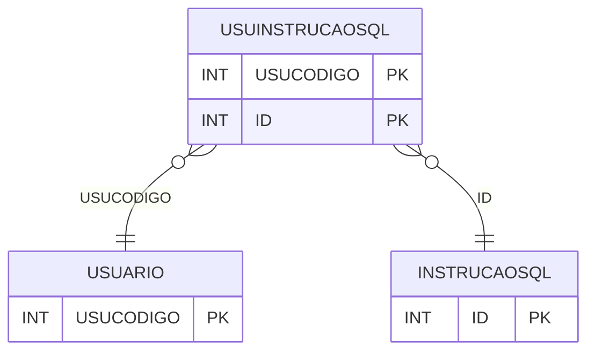

# USUINSTRUCAOSQL - Documentação Completa de Relacionamentos

## 📊 Informações Gerais

- **Nome da Tabela**: USUINSTRUCAOSQL (Usuário Instrução SQL)
- **Total de Registros**: 130
- **Total de Colunas**: 2
- **Chave Primária**: USUCODIGO, ID (composite)
- **Chaves Estrangeiras**: 2
- **Índices**: 0
- **Tabelas Dependentes**: 0
- **Banco de Dados**: Firebird

## 📝 Descrição

**USUINSTRUCAOSQL** é uma tabela intermediária que associa usuários a instruções SQL. Com **130 registros**, esta tabela registra quais instruções SQL cada usuário tem permissão para executar.

Esta tabela é essencial para:
- **Permissões SQL**: Gerenciar permissões de execução SQL por usuário
- **Segurança**: Controlar acesso a instruções SQL
- **Rastreamento**: Rastrear permissões SQL por usuário
- **Relatórios**: Gerar relatórios de permissões SQL

---

## 🔑 Estrutura de Colunas

| Coluna | Tipo | Descrição |
|--------|------|-----------|
| **USUCODIGO** 🔑 🔗 | INT | Código do usuário (PK, FK → USUARIO) |
| **ID** 🔑 🔗 | INT | ID da instrução SQL (PK, FK → INSTRUCAOSQL) |

---

## 🔗 Relacionamentos - Nível 1 (Diretos)

### USUARIO - Usuário (FK Obrigatória)
**Volume:** 297 registros

**Relacionamento:**
```
USUINSTRUCAOSQL.USUCODIGO → USUARIO.USUCODIGO (N:1)
Constraint: XFK_USUSQL_USU
```

### INSTRUCAOSQL - Instrução SQL (FK Obrigatória)
**Volume:** Variável

**Relacionamento:**
```
USUINSTRUCAOSQL.ID → INSTRUCAOSQL.ID (N:1)
Constraint: XFK_USUSQL_INSTRUCAOSQL
```

---

## 🗺️ Diagrama de Relacionamentos



---

## 💡 Exemplos de Uso

### Consulta Básica

```sql
SELECT USUCODIGO, ID
FROM USUINSTRUCAOSQL
WHERE USUCODIGO = ?;
```

---

## ⚡ Performance e Otimização

### Índices Recomendados

#### 1. Índice Composto na Chave Primária (Já existe implicitamente)
```sql
-- Índice primário já existe implicitamente
```

---

## 📊 Estatísticas e Insights

- **Total de Registros**: 130
- **Permissões SQL**: 130 permissões de instruções SQL por usuário

---

**Documentação gerada em**: 2025-01-27

**Banco de dados**: Firebird

