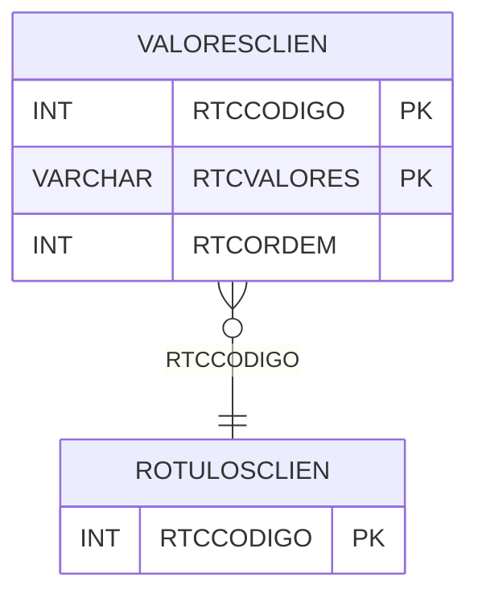

# VALORESCLIEN - Documentação Completa de Relacionamentos

## 📊 Informações Gerais

- **Nome da Tabela**: VALORESCLIEN (Valores Cliente)
- **Total de Registros**: 31
- **Total de Colunas**: 3
- **Chave Primária**: RTCCODIGO, RTCVALORES (composite)
- **Chaves Estrangeiras**: 1
- **Índices**: 0
- **Tabelas Dependentes**: 0
- **Banco de Dados**: Firebird

## 📝 Descrição

**VALORESCLIEN** é uma tabela intermediária que armazena valores associados a rótulos de clientes. Com apenas **31 registros**, esta tabela registra valores possíveis para cada rótulo de cliente, permitindo classificação e organização de clientes.

Esta tabela é essencial para:
- **Rótulos**: Gerenciar valores de rótulos de clientes
- **Classificação**: Classificar clientes por valores
- **Rastreamento**: Rastrear valores por rótulo
- **Relatórios**: Gerar relatórios de valores de clientes

---

## 🔑 Estrutura de Colunas

| Coluna | Tipo | Descrição |
|--------|------|-----------|
| **RTCCODIGO** 🔑 🔗 | INT | Código do rótulo de cliente (PK, FK → ROTULOSCLIEN) |
| **RTCVALORES** 🔑 | VARCHAR(37) | Valor do rótulo (PK) |
| **RTCORDEM** | INT | Ordem de exibição |

---

## 🔗 Relacionamentos - Nível 1 (Diretos)

### ROTULOSCLIEN - Rótulos Cliente (FK Obrigatória)
**Volume:** Variável

**Relacionamento:**
```
VALORESCLIEN.RTCCODIGO → ROTULOSCLIEN.RTCCODIGO (N:1)
Constraint: ROTULOSCLIEN_VALORESCLIEN
```

---

## 🗺️ Diagrama de Relacionamentos



---

## 💡 Exemplos de Uso

### Consulta Básica

```sql
SELECT RTCCODIGO, RTCVALORES, RTCORDEM
FROM VALORESCLIEN
WHERE RTCCODIGO = ?
ORDER BY RTCORDEM;
```

---

## ⚡ Performance e Otimização

### Índices Recomendados

#### 1. Índice Composto na Chave Primária (Já existe implicitamente)
```sql
-- Índice primário já existe implicitamente
```

---

## 📊 Estatísticas e Insights

- **Total de Registros**: 31
- **Valores**: 31 valores de rótulos de clientes cadastrados

---

**Documentação gerada em**: 2025-01-27

**Banco de dados**: Firebird

