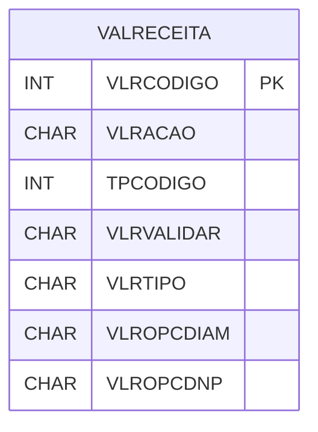

# VALRECEITA - Documentação Completa de Relacionamentos

## 📊 Informações Gerais

- **Nome da Tabela**: VALRECEITA (Validação Receita)
- **Total de Registros**: 30
- **Total de Colunas**: 31
- **Chave Primária**: VLRCODIGO
- **Chaves Estrangeiras**: 0
- **Índices**: 0
- **Tabelas Dependentes**: 0
- **Banco de Dados**: Firebird

## 📝 Descrição

**VALRECEITA** é uma tabela mestre que armazena configurações de validação para receitas ópticas. Com **30 registros**, esta tabela define regras de validação para diversos parâmetros de receitas, incluindo diâmetro, DNP, DP, DPA, PNT, DMA, ARM, grau, adição, altura, MHA, MVA, eixo, base, linha, e outras validações específicas.

Esta tabela é essencial para:
- **Validação**: Validar receitas ópticas
- **Configuração**: Armazenar regras de validação
- **Rastreamento**: Rastrear regras de validação
- **Relatórios**: Gerar relatórios de validação

---

## 🔑 Estrutura de Colunas (Principais)

| Coluna | Tipo | Descrição |
|--------|------|-----------|
| **VLRCODIGO** 🔑 | INT | Código da validação (PK) |
| **VLRACAO** | CHAR(1) | Ação da validação |
| **TPCODIGO** | INT | Código do tipo |
| **VLRVALIDAR** | CHAR(1) | Validar |
| **VLRTIPO** | CHAR(1) | Tipo da validação |
| **VLROPCDIAM** | CHAR(1) | Validar diâmetro |
| **VLROPCDNP** | CHAR(1) | Validar DNP |
| **VLROPCDP** | CHAR(1) | Validar DP |
| **VLROPCDPA** | CHAR(1) | Validar DPA |
| **VLROPCPNT** | CHAR(1) | Validar PNT |
| **VLROPCDMA** | CHAR(1) | Validar DMA |
| **VLROPCARM** | CHAR(1) | Validar ARM |
| **VLROPCGRAUP** | CHAR(1) | Validar grau P |
| **VLROPCGRAUL** | CHAR(1) | Validar grau L |
| **VLROPCADIC** | CHAR(1) | Validar adição |
| **VLROPCALT** | CHAR(1) | Validar altura |
| **VLROPCMHA** | CHAR(1) | Validar MHA |
| **VLROPCMVA** | CHAR(1) | Validar MVA |
| **VLROPCEIXO** | CHAR(1) | Validar eixo |
| **VLROPCBASE** | CHAR(1) | Validar base |
| **VLROPCLINHA** | CHAR(1) | Validar linha |
| **VLROPCDIAMOK** | CHAR(1) | Diâmetro OK |
| **VLROPCALTOK** | CHAR(1) | Altura OK |
| **VLROPCDESCMAX** | CHAR(1) | Desconto máximo |
| **VLROPCADICAOOK** | CHAR(1) | Adição OK |
| **VLROPCARO** | CHAR(1) | Aro |
| **VLROPCGRAUCIL** | CHAR(1) | Grau cilíndrico |
| **VLROPCMODARM** | CHAR(1) | Modelo armadura |
| **VLRPROCESSO** | CHAR(1) | Processo |
| **VLROPCALTMVA** | CHAR(1) | Altura MVA |
| **VLROPCMEIOPAR** | CHAR(1) | Meio par |

---

## 🗺️ Diagrama de Relacionamentos



---

## 💡 Exemplos de Uso

### Consulta Básica

```sql
SELECT VLRCODIGO, VLRACAO, TPCODIGO, VLRVALIDAR, VLRTIPO, VLROPCDIAM, VLROPCDNP
FROM VALRECEITA
WHERE VLRCODIGO = ?;
```

---

## ⚡ Performance e Otimização

### Índices Recomendados

#### 1. Índice na Chave Primária (Já existe implicitamente)
```sql
-- Índice primário já existe implicitamente
```

---

## 📊 Estatísticas e Insights

- **Total de Registros**: 30
- **Validações**: 30 configurações de validação de receitas cadastradas

---

**Documentação gerada em**: 2025-01-27

**Banco de dados**: Firebird

