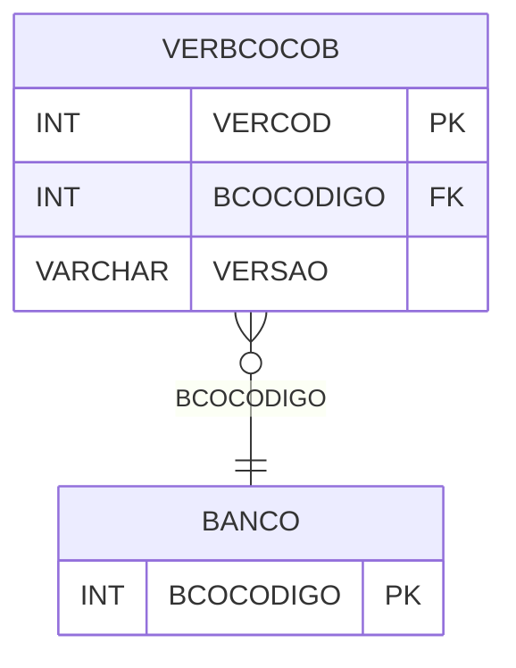

# VERBCOCOB - Documentação Completa de Relacionamentos

## 📊 Informações Gerais

- **Nome da Tabela**: VERBCOCOB (Versão Banco Cobrança)
- **Total de Registros**: 3
- **Total de Colunas**: 3
- **Chave Primária**: VERCOD
- **Chaves Estrangeiras**: 1
- **Índices**: 0
- **Tabelas Dependentes**: 0
- **Banco de Dados**: Firebird

## 📝 Descrição

**VERBCOCOB** é uma tabela de configuração que armazena informações sobre versões de arquivos de cobrança por banco. Com apenas **3 registros**, esta tabela define versões de arquivos de cobrança utilizadas por cada banco.

Esta tabela é essencial para:
- **Cobrança**: Gerenciar versões de arquivos de cobrança
- **Bancos**: Associar versões a bancos
- **Rastreamento**: Rastrear versões por banco

---

## 🔑 Estrutura de Colunas

| Coluna | Tipo | Descrição |
|--------|------|-----------|
| **VERCOD** 🔑 | INT | Código da versão (PK) |
| **BCOCODIGO** 🔗 | INT | Código do banco (FK → BANCO) |
| **VERSAO** | VARCHAR(37) | Versão do arquivo |

---

## 🔗 Relacionamentos - Nível 1 (Diretos)

### BANCO - Banco (FK Obrigatória)
**Volume:** Variável

**Relacionamento:**
```
VERBCOCOB.BCOCODIGO → BANCO.BCOCODIGO (N:1)
Constraint: BCOCODIGO_VERBCOCOB
```

---

## 🗺️ Diagrama de Relacionamentos



---

## 💡 Exemplos de Uso

### Consulta Básica

```sql
SELECT VERCOD, BCOCODIGO, VERSAO
FROM VERBCOCOB
WHERE BCOCODIGO = ?;
```

---

## ⚡ Performance e Otimização

### Índices Recomendados

#### 1. Índice na Chave Primária (Já existe implicitamente)
```sql
-- Índice primário já existe implicitamente
```

---

## 📊 Estatísticas e Insights

- **Total de Registros**: 3
- **Versões**: 3 versões de arquivos de cobrança por banco

---

**Documentação gerada em**: 2025-01-27

**Banco de dados**: Firebird

