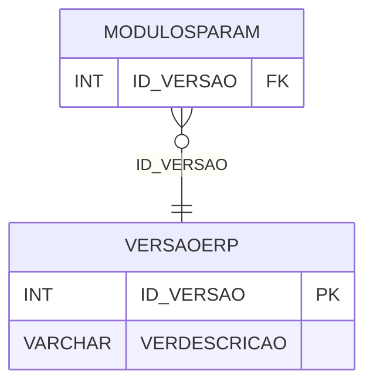

# VERSAOERP - Documentação Completa de Relacionamentos

## 📊 Informações Gerais

- **Nome da Tabela**: VERSAOERP (Versão ERP)
- **Total de Registros**: 6
- **Total de Colunas**: 2
- **Chave Primária**: ID_VERSAO
- **Chaves Estrangeiras**: 0
- **Índices**: 0
- **Tabelas Dependentes**: 1
- **Banco de Dados**: Firebird

## 📝 Descrição

**VERSAOERP** é uma tabela mestre que armazena informações sobre versões do ERP. Com apenas **6 registros**, esta tabela define versões do sistema ERP disponíveis, incluindo descrição.

Esta tabela é essencial para:
- **Versões**: Gerenciar versões do ERP
- **Configuração**: Armazenar configurações por versão
- **Rastreamento**: Rastrear versões disponíveis
- **Relatórios**: Gerar relatórios de versões

---

## 🔑 Estrutura de Colunas

| Coluna | Tipo | Descrição |
|--------|------|-----------|
| **ID_VERSAO** 🔑 | INT | ID da versão (PK) |
| **VERDESCRICAO** | VARCHAR(37) | Descrição da versão |

---

## 📊 Tabelas que Referenciam Esta

Esta tabela é referenciada por 1 tabela:

### MODULOSPARAM - Módulos Parâmetros
**Volume:** Variável

**Relacionamento:**
```
MODULOSPARAM.ID_VERSAO → VERSAOERP.ID_VERSAO (N:1)
Constraint: XFK_VERSAOERP
```

---

## 🗺️ Diagrama de Relacionamentos



---

## 💡 Exemplos de Uso

### Consulta Básica

```sql
SELECT ID_VERSAO, VERDESCRICAO
FROM VERSAOERP
WHERE ID_VERSAO = ?;
```

---

## ⚡ Performance e Otimização

### Índices Recomendados

#### 1. Índice na Chave Primária (Já existe implicitamente)
```sql
-- Índice primário já existe implicitamente
```

---

## 📊 Estatísticas e Insights

- **Total de Registros**: 6
- **Versões**: 6 versões do ERP cadastradas

---

**Documentação gerada em**: 2025-01-27

**Banco de dados**: Firebird

