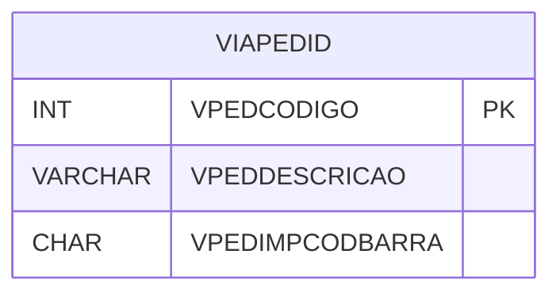

# VIAPEDID - Documentação Completa de Relacionamentos

## 📊 Informações Gerais

- **Nome da Tabela**: VIAPEDID (Via Pedido)
- **Total de Registros**: 1
- **Total de Colunas**: 3
- **Chave Primária**: VPEDCODIGO
- **Chaves Estrangeiras**: 0
- **Índices**: 0
- **Tabelas Dependentes**: 0
- **Banco de Dados**: Firebird

## 📝 Descrição

**VIAPEDID** é uma tabela de configuração que armazena informações sobre vias de pedido. Com apenas **1 registro**, esta tabela define configurações de vias de pedido, incluindo descrição e configuração de impressão de código de barras.

Esta tabela é essencial para:
- **Configuração**: Armazenar configurações de vias de pedido
- **Impressão**: Configurar impressão de códigos de barras
- **Rastreamento**: Rastrear configurações de vias

---

## 🔑 Estrutura de Colunas

| Coluna | Tipo | Descrição |
|--------|------|-----------|
| **VPEDCODIGO** 🔑 | INT | Código da via de pedido (PK) |
| **VPEDDESCRICAO** | VARCHAR(37) | Descrição da via |
| **VPEDIMPCODBARRA** | CHAR(1) | Imprimir código de barras |

---

## 🗺️ Diagrama de Relacionamentos



---

## 💡 Exemplos de Uso

### Consulta Básica

```sql
SELECT VPEDCODIGO, VPEDDESCRICAO, VPEDIMPCODBARRA
FROM VIAPEDID
WHERE VPEDCODIGO = ?;
```

---

## ⚡ Performance e Otimização

### Índices Recomendados

#### 1. Índice na Chave Primária (Já existe implicitamente)
```sql
-- Índice primário já existe implicitamente
```

---

## 📊 Estatísticas e Insights

- **Total de Registros**: 1
- **Uso**: Tabela de configuração com volume mínimo

---

**Documentação gerada em**: 2025-01-27

**Banco de dados**: Firebird

