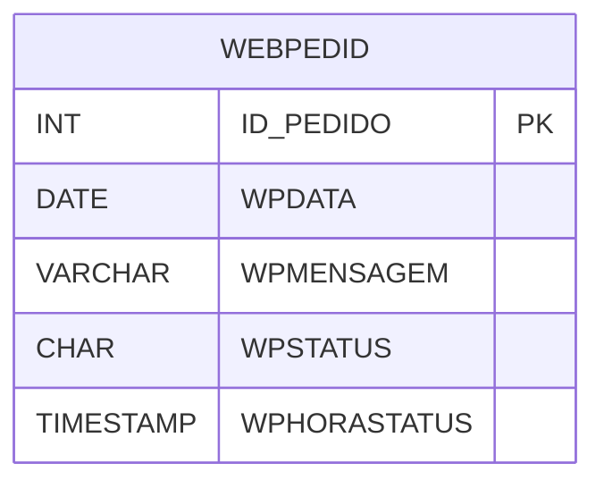

# WEBPEDID - Documentação Completa de Relacionamentos

## 📊 Informações Gerais

- **Nome da Tabela**: WEBPEDID (Web Pedido)
- **Total de Registros**: 1
- **Total de Colunas**: 5
- **Chave Primária**: ID_PEDIDO
- **Chaves Estrangeiras**: 0
- **Índices**: 0
- **Tabelas Dependentes**: 0
- **Banco de Dados**: Firebird

## 📝 Descrição

**WEBPEDID** é uma tabela de configuração que armazena informações sobre pedidos web. Com apenas **1 registro**, esta tabela define configurações de pedidos web, incluindo data, mensagem, status e hora do status.

Esta tabela é essencial para:
- **Configuração**: Armazenar configurações de pedidos web
- **Status**: Gerenciar status de pedidos web
- **Rastreamento**: Rastrear configurações de pedidos

---

## 🔑 Estrutura de Colunas

| Coluna | Tipo | Descrição |
|--------|------|-----------|
| **ID_PEDIDO** 🔑 | INT | ID do pedido (PK) |
| **WPDATA** | DATE | Data do pedido |
| **WPMENSAGEM** | VARCHAR(37) | Mensagem |
| **WPSTATUS** | CHAR(1) | Status do pedido |
| **WPHORASTATUS** | TIMESTAMP | Hora do status |

---

## 🗺️ Diagrama de Relacionamentos



---

## 💡 Exemplos de Uso

### Consulta Básica

```sql
SELECT ID_PEDIDO, WPDATA, WPMENSAGEM, WPSTATUS, WPHORASTATUS
FROM WEBPEDID
WHERE ID_PEDIDO = ?;
```

---

## ⚡ Performance e Otimização

### Índices Recomendados

#### 1. Índice na Chave Primária (Já existe implicitamente)
```sql
-- Índice primário já existe implicitamente
```

---

## 📊 Estatísticas e Insights

- **Total de Registros**: 1
- **Uso**: Tabela de configuração com volume mínimo

---

**Documentação gerada em**: 2025-01-27

**Banco de dados**: Firebird

