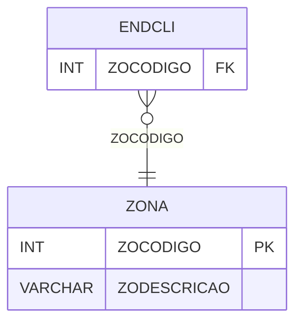

# ZONA - Documentação Completa de Relacionamentos

## 📊 Informações Gerais

- **Nome da Tabela**: ZONA
- **Total de Registros**: 17
- **Total de Colunas**: 2
- **Chave Primária**: ZOCODIGO
- **Chaves Estrangeiras**: 0
- **Índices**: 0
- **Tabelas Dependentes**: 1
- **Banco de Dados**: Firebird

## 📝 Descrição

**ZONA** é uma tabela mestre que armazena informações sobre zonas geográficas. Com **17 registros**, esta tabela define zonas disponíveis no sistema, incluindo descrição.

Esta tabela é essencial para:
- **Geografia**: Gerenciar zonas geográficas
- **Endereços**: Classificar endereços por zona
- **Rastreamento**: Rastrear zonas disponíveis
- **Relatórios**: Gerar relatórios por zona

---

## 🔑 Estrutura de Colunas

| Coluna | Tipo | Descrição |
|--------|------|-----------|
| **ZOCODIGO** 🔑 | INT | Código da zona (PK) |
| **ZODESCRICAO** | VARCHAR(37) | Descrição da zona |

---

## 📊 Tabelas que Referenciam Esta

Esta tabela é referenciada por 1 tabela:

### ENDCLI - Endereço Cliente
**Volume:** Variável

**Relacionamento:**
```
ENDCLI.ZOCODIGO → ZONA.ZOCODIGO (N:1)
Constraint: ZONA_ENDCLI
```

---

## 🗺️ Diagrama de Relacionamentos



---

## 💡 Exemplos de Uso

### Consulta Básica

```sql
SELECT ZOCODIGO, ZODESCRICAO
FROM ZONA
WHERE ZOCODIGO = ?;
```

---

## ⚡ Performance e Otimização

### Índices Recomendados

#### 1. Índice na Chave Primária (Já existe implicitamente)
```sql
-- Índice primário já existe implicitamente
```

---

## 📊 Estatísticas e Insights

- **Total de Registros**: 17
- **Zonas**: 17 zonas geográficas cadastradas

---

**Documentação gerada em**: 2025-01-27

**Banco de dados**: Firebird

