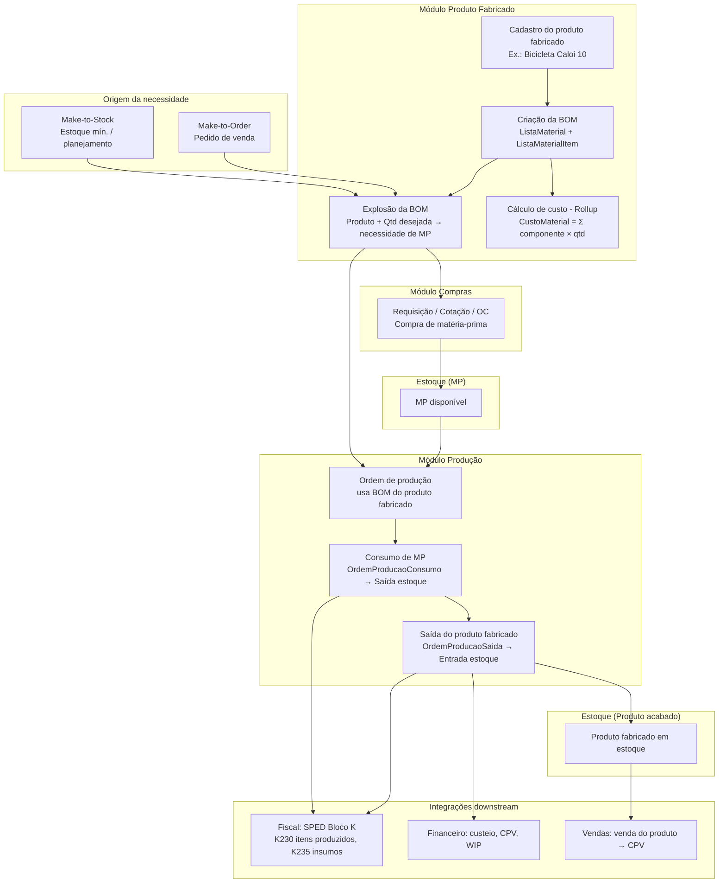

# Pesquisa: Módulo Produto Fabricado para ERP Genérico

> Levantamento completo de entidades, fluxos, relatórios, KPIs, custeio, integrações com Estoque/Compras/Vendas/Financeiro/Produção e requisitos fiscais brasileiros (SPED Bloco K) para implementação do módulo **Produto Fabricado** no OpticalCore ERP.
> **Conceito central:** O laboratório/empresa **cria produtos próprios a partir de matéria-prima** (e semiacabados). Um **produto fabricado** é definido por uma **Lista de Materiais (BOM)** que especifica quais componentes e em que quantidades são necessários para produzir uma unidade do produto. Exemplo: "Bicicleta Caloi 10" é fabricada a partir de tubo de metal, banco, corrente, câmbio 10 marchas, etc.
> Referências: SAP PP (BOM, CS01), Oracle Manufacturing, Odoo MRP, Microsoft Dynamics 365 Supply Chain (BOM), ERPNext Bill of Materials, TOTVS Protheus, SPED Bloco K.

---

## 1. Visão Geral do Módulo

O módulo **Produto Fabricado** é o módulo em que o **laboratório/empresa define e gerencia produtos que são fabricados a partir de matéria-prima e semiacabados**. Ele responde a: **o que** é o produto acabado, **de que** ele é feito (componentes e quantidades) e **como** isso se integra a estoque, compras, vendas, produção e custeio.

- **Produto fabricado:** Item acabado ou semiacabado cuja origem é **fabricação interna** (não apenas compra). Exemplos: Bicicleta Caloi 10, Lente oftálmica acabada, Kit montado, Produto químico formulado.
- **Matéria-prima e componentes:** Itens em estoque (comprados ou produzidos) que entram na composição do produto fabricado. Ex.: tubo de metal, banco, corrente, câmbio 10 marchas para a bicicleta; bloco, cera, lixas para a lente.
- **Lista de Materiais (BOM — Bill of Materials):** Documento que lista **todos os componentes** necessários para produzir **uma unidade** (ou quantidade base) do produto fabricado, com **quantidade** e **unidade de medida** de cada componente. Funciona como "receita" ou "blueprint" do produto.

O módulo cobre a **estrutura do produto** (cadastro do produto fabricado, BOM, versões, tipo de BOM), o **cálculo de custo** (rollup de material a partir da BOM), a **explosão de necessidades** (quanto de cada MP é necessário para produzir X unidades) e as **integrações** com Estoque (consumo de MP, entrada do produto fabricado), Compras (compra de MP), Vendas (venda do produto fabricado), Financeiro (custeio, CPV) e Produção (ordem de produção utiliza a BOM).

**Integrações essenciais:**

| Módulo     | Sentido    | Integração |
|-----------|------------|------------|
| Estoque   | ↔ Produto Fabricado | Consumo de MP (saída) e entrada do produto fabricado; reserva para produção; saldos por produto |
| Compras   | ← Produto Fabricado | Necessidade de MP (explosão da BOM) gera requisição/cotação/compra de matéria-prima |
| Vendas    | ↔ Produto Fabricado | Venda do produto fabricado; make-to-order pode disparar necessidade de produção |
| Financeiro| ↔ Produto Fabricado | Custeio do produto (rollup BOM); custo do produto vendido (CPV) |
| Produção  | ← Produto Fabricado | Ordem de produção usa BOM para consumo de MP e geração do produto acabado |
| Fiscal    | ← Produto Fabricado | SPED Bloco K (itens produzidos, insumos consumidos) alimentado pela produção que usa o produto fabricado/BOM |

---

## 2. Entidades Propostas

### 2.1 Dados Mestres (Cadastro do Produto Fabricado e da BOM)

| Entidade | Descrição | Schema |
|----------|-----------|--------|
| **Produto** | Cadastro central do produto (já existente no Estoque). No contexto Produto Fabricado: produto com **TipoProduto = Acabado** ou **Semi-Acabado** e que possui **Lista de Materiais** para fabricação | Tenant |
| **ListaMaterial (BOM)** | Lista de materiais: associa um **produto fabricado** (pai) aos **componentes** (filhos) e quantidades necessárias para produzir uma unidade (ou quantidade base). Pode ter versão e vigência | Tenant |
| **ListaMaterialItem** | Item da BOM: produto componente (MP ou semiacabado), quantidade por unidade do pai, unidade de medida, sequência, tipo de item (normal, fantasma, sobressalente). Pode ter percentual de perda | Tenant |
| **RoteiroProducao** | (Opcional) Roteiro de fabricação do produto fabricado: sequência de operações/células. Usado pelo módulo Produção para execução; referenciado aqui para vínculo produto → roteiro | Tenant |
| **VersaoListaMaterial** | (Opcional) Versões da BOM com vigência (data início/fim) para controle de mudança de engenharia | Tenant |

### 2.2 Tipos de BOM e de Item na BOM

| Conceito | Descrição |
|----------|-----------|
| **BOM single-level** | Uma única nível: o produto fabricado lista apenas componentes diretos (todos MP ou semiacabados). |
| **BOM multi-level** | O produto fabricado pode ter como componente um **semiacabado** que, por sua vez, tem sua própria BOM. A explosão da BOM desce níveis até chegar só a MP. |
| **Item fantasma (phantom)** | Componente que "desaparece" na explosão: não é estocado como tal; seus componentes são "elevados" para o nível do pai. Útil para agrupar componentes logicamente sem gerar ordem de produção para o fantasma. |
| **Co-produto** | Produto gerado junto com o principal no mesmo processo (ex.: dois produtos com custo alocado por percentual). |
| **Subproduto** | Saída secundária de menor valor (ex.: refugo reaproveitável). |

### 2.3 Dados de Custeio e Planejamento

| Entidade | Descrição |
|----------|-----------|
| **CustoProduto** | Custo do produto (padrão ou último): para produto fabricado, pode ser calculado por **rollup** a partir da BOM (custo dos componentes × quantidades) + mão de obra e overhead quando houver roteiro. Integração com Financeiro. |
| **HistoricoCustoProduto** | Snapshot do custo por período ou por alteração de BOM (auditoria e análise). |
| **NecessidadeMaterial** | (Derivado/relatório) Resultado da **explosão da BOM**: para uma quantidade a produzir do produto fabricado, lista de componentes e quantidades necessárias (para planejamento e Compras). |

### 2.4 Domínios / Lookup

| Entidade | Descrição |
|----------|-----------|
| **TipoProduto** | Acabado, Semi-Acabado, Matéria-Prima, Serviço, Kit (compatível com Estoque). Produto fabricado = Acabado ou Semi-Acabado com BOM. |
| **TipoListaMaterial** | Fabricação, Kit de venda, Fantasma, Fórmula (processo). |
| **TipoItemBOM** | Normal, Fantasma, Sobressalente. |

---

## 3. Campos Chave das Entidades

### 3.1 Produto (extensão para Produto Fabricado)

Além dos campos já existentes no módulo Estoque (Código, Nome, SKU, NCM, TipoProduto, UnidadeMedidaId, CustoUnitario, etc.):

| Campo | Tipo | Descrição |
|-------|------|-----------|
| TipoProduto | enum | Acabado, Semi-Acabado, Matéria-Prima, Serviço, Kit. Para produto fabricado: **Acabado** ou **Semi-Acabado**. |
| Fabricado | bool | Indica que o produto é fabricado internamente (possui BOM e pode ser resultado de ordem de produção). |
| ListaMaterialId | FK | BOM padrão utilizada para fabricação (nullable; pode haver mais de uma BOM por produto com versão/vigência). |
| RoteiroProducaoId | FK | Roteiro de produção padrão (opcional; usado pelo módulo Produção). |
| LeadTimeProducaoDias | int | Prazo médio de produção em dias (para planejamento). |

### 3.2 ListaMaterial (BOM)

| Campo | Tipo | Descrição |
|-------|------|-----------|
| Id | Guid | PK |
| ProdutoId | FK | **Produto fabricado** (pai) ao qual esta BOM se aplica. |
| Versao | string(20) | Versão da BOM (ex.: "01", "A", "2024-01"). |
| TipoListaMaterial | enum | Fabricação, Kit, Fantasma, Fórmula. |
| QuantidadeProducao | decimal(18,3) | Quantidade do produto pai produzida por esta BOM (geralmente 1). |
| UnidadeMedidaId | FK | Unidade do produto pai. |
| DataInicioVigencia | date | Vigência início. |
| DataFimVigencia | date | Vigência fim (nullable). |
| Ativo | bool | Se está ativa para novas ordens. |
| Observacoes | text | Observações. |

### 3.3 ListaMaterialItem

| Campo | Tipo | Descrição |
|-------|------|-----------|
| ListaMaterialId | FK | BOM pai. |
| ProdutoId | FK | **Componente** (MP ou semiacabado). |
| Sequencia | int | Ordem na lista. |
| Quantidade | decimal(18,6) | Quantidade do componente **por unidade** do produto pai (conforme QuantidadeProducao da BOM). |
| UnidadeMedidaId | FK | Unidade do componente. |
| TipoItemBOM | enum | Normal, Fantasma, Sobressalente. |
| PercentualPerda | decimal(5,2) | % de perda esperada (opcional); aumenta a necessidade na explosão. |
| CustoUnitarioPadrao | decimal(18,4) | Custo padrão do componente (para rollup de custo da BOM). |
| Observacao | text | Observação do item. |

### 3.4 CustoProduto (módulo Produto Fabricado / Financeiro)

| Campo | Tipo | Descrição |
|-------|------|-----------|
| ProdutoId | FK | Produto. |
| CustoMaterial | decimal(18,4) | Custo de material (rollup da BOM). |
| CustoMaoObra | decimal(18,4) | Custo de mão de obra (quando houver roteiro). |
| CustoOverhead | decimal(18,4) | Custo indireto. |
| CustoTotal | decimal(18,4) | Custo total unitário. |
| DataCalculo | datetime | Data do último cálculo. |
| MetodoCusteio | enum | Padrão, Médio, Último custo real. |

---

## 4. Fluxos de Negócio

### 4.1 Cadastro de um Produto Fabricado (ex.: Bicicleta Caloi 10)

1. **Cadastro do produto** no módulo Estoque (ou cadastro central): criar produto "Bicicleta Caloi 10", TipoProduto = Acabado, Fabricado = true, UnidadeMedida = un.
2. **Criação da BOM:** criar ListaMaterial com ProdutoId = Bicicleta Caloi 10, QuantidadeProducao = 1, TipoListaMaterial = Fabricação.
3. **Inclusão dos itens da BOM:** para cada componente (tubo de metal, banco, corrente, câmbio 10 marchas, etc.), criar ListaMaterialItem com ProdutoId = componente, Quantidade = quantidade necessária por bicicleta (ex.: 1 banco, 1 corrente, 1 câmbio, X metros de tubo).
4. **Cálculo de custo (rollup):** a partir da BOM, calcular CustoMaterial do produto fabricado = soma (CustoUnitario do componente × Quantidade) para todos os itens. Atualizar CustoProduto / CustoUnitario do produto.
5. **Roteiro (opcional):** se houver módulo Produção com roteiro (operações/células), vincular RoteiroProducao ao produto para custeio de mão de obra e overhead.

### 4.2 Explosão da BOM (Necessidade de Materiais)

- **Entrada:** Produto fabricado + quantidade desejada (ex.: 10 bicicletas).
- **Processamento:** Para cada item da BOM do produto, quantidade necessária = Quantidade × (quantidade desejada / QuantidadeProducao da BOM). Se o componente for semiacabado com BOM, repetir recursivamente (multi-level).
- **Saída:** Lista de **matérias-primas** (e semiacabados) com quantidades totais necessárias. Usado para: **requisição de compra**, **reserva de estoque**, **ordem de produção** (módulo Produção consome conforme BOM).

### 4.3 Integração com Ordem de Produção (módulo Produção)

- Ao **liberar uma ordem de produção** para um produto fabricado, o sistema utiliza a **BOM** do produto para:
  - Gerar os itens de **consumo** (OrdemProducaoConsumo): cada ListaMaterialItem vira uma linha de consumo (produto, quantidade planejada = quantidade da BOM × quantidade da OP).
  - Baixar estoque (MovimentacaoEstoque Saída) quando o consumo for confirmado.
- Ao **encerrar a ordem**, o sistema registra a **saída do produto fabricado** (OrdemProducaoSaida) e gera entrada em estoque (MovimentacaoEstoque Entrada). O custo do produto fabricado pode ser calculado com base no consumo real (MP) + mão de obra/overhead (roteiro).

### 4.4 Make-to-Stock vs Make-to-Order

- **Make-to-Stock:** Produção para estoque; a necessidade é driven por estoque mínimo, ponto de reposição ou planejamento (MPS/MRP). Explosão da BOM gera necessidade de MP; ordens de produção são planejadas.
- **Make-to-Order:** Pedido de venda dispara a necessidade de produzir. O produto fabricado é vinculado ao pedido; a explosão da BOM gera necessidade de MP e pode gerar requisição de compra e ordem de produção. Integração Vendas → Produto Fabricado (necessidade) → Compras/Produção.

### 4.5 Ilustração do fluxo

O diagrama abaixo resume o funcionamento do módulo Produto Fabricado e sua relação com os demais módulos: desde o **cadastro do produto fabricado e da BOM**, passando pelo **custeio (rollup)**, **explosão de necessidades**, **compras de MP** e **ordem de produção**, até a **entrada do produto fabricado no estoque** e as **integrações** com Vendas, Financeiro e Fiscal.



**Resumo do fluxo em etapas:**

1. **Cadastro (Produto Fabricado):** Produto com `Fabricado = true` e BOM (ListaMaterial + itens com componentes e quantidades por unidade).
2. **Custeio:** Rollup da BOM atualiza o custo do produto (material; opcional: mão de obra e overhead via roteiro).
3. **Explosão:** Para uma quantidade a produzir, o sistema calcula quanto de cada MP é necessário; a necessidade pode vir de **make-to-stock** (estoque mínimo/planejamento) ou **make-to-order** (pedido de venda).
4. **Compras:** A explosão gera requisição/cotação/ordem de compra para MP com saldo insuficiente; a MP comprada entra no estoque.
5. **Produção:** A ordem de produção referencia o produto fabricado e sua BOM; ao liberar, são gerados os consumos (por item da BOM); ao confirmar consumo, há baixa de MP no estoque; ao encerrar a OP, registra-se a saída do produto fabricado e dá-se entrada no estoque.
6. **Estoque:** Produto fabricado passa a ter saldo disponível para venda.
7. **Vendas / Financeiro / Fiscal:** Venda do produto gera CPV; custeio e WIP integram ao Financeiro; Produção alimenta o Bloco K (K230, K235).

---

## 5. Relatórios e KPIs

### 5.1 Relatórios Operacionais

| Relatório | Descrição |
|-----------|-----------|
| BOM por produto | Lista de materiais de um produto fabricado (single-level ou explosão multi-level). |
| Explosão de necessidades | Dado produto + quantidade: lista de componentes e quantidades (flat ou por nível). |
| Implosão (where-used) | Dado um componente: em quais produtos fabricados ele é usado e em que quantidade. |
| Produtos sem BOM | Produtos marcados como fabricados mas sem BOM cadastrada (inconsistência). |
| Custo rollup por produto | Custo calculado a partir da BOM (material) por produto fabricado. |

### 5.2 KPIs

| KPI | Descrição |
|-----|-----------|
| Cobertura de BOM | % de produtos fabricados com BOM ativa. |
| Variação de custo BOM | Diferença entre custo padrão (rollup) e custo real (após produção). |
| Componentes críticos | Itens da BOM com maior impacto no custo ou com estoque baixo. |

### 5.3 Estrutura de menu (sidebar)

Abaixo, a estrutura proposta para o menu lateral (sidebar) do módulo **Produto Fabricado**, alinhada ao padrão dos demais módulos (Estoque, Compras, Vendas): item raiz com ícone, **Painel**, cadastros/operações principais e submenu **Relatórios**.

**Lista de Materiais (BOM) integrada ao cadastro de Produtos fabricados:** A BOM não é um item de menu separado. Ao cadastrar ou editar um produto fabricado, o usuário define na mesma tela (em aba ou seção **Lista de Materiais (BOM)** / **Componentes**) quais materiais/componentes o produto utiliza e em que quantidade por unidade. Ou seja: um único fluxo — o cadastro do produto fabricado já inclui a definição da receita (componentes e quantidades).

| Nível | Item | Rota (path) | Observação |
|-------|------|-------------|------------|
| 0 | **Produto Fabricado** | — | Ícone sugerido: `PrecisionManufacturing` ou `Build` (MUI). Agrupador, sem rota direta. |
| 1 | Painel | `/producao/painel` | Dashboard do módulo: KPIs (cobertura de BOM, variação de custo, componentes críticos). |
| 1 | Produtos fabricados | `/producao/produtos` | Lista de produtos com `Fabricado = true`. Ao abrir (novo ou existente): dados do produto + aba/seção **Lista de Materiais (BOM)** para cadastro dos componentes e quantidades. |
| 1 | Explosão de necessidades | `/producao/explosao-necessidades` | Tela para informar produto + quantidade e obter a lista de MP/componentes necessários. |
| 1 | Roteiros de produção | `/producao/roteiros` | (Opcional) Cadastro de roteiros vinculados ao produto fabricado. |
| 1 | **Relatórios** | — | Submenu (accordion), sem rota direta. Ícone: `BarChart`. |
| 2 | BOM por produto | `/producao/relatorios/bom-por-produto` | Lista de materiais (single-level ou multi-level) de um produto. |
| 2 | Explosão de necessidades | `/producao/relatorios/explosao-necessidades` | Relatório: produto + quantidade → componentes e quantidades. |
| 2 | Implosão (where-used) | `/producao/relatorios/implosao` | Dado um componente: em quais produtos fabricados é usado. |
| 2 | Produtos sem BOM | `/producao/relatorios/produtos-sem-bom` | Produtos marcados como fabricados sem BOM cadastrada. |
| 2 | Custo rollup por produto | `/producao/relatorios/custo-rollup` | Custo calculado a partir da BOM por produto fabricado. |
| 2 | Variação de custo BOM | `/producao/relatorios/variacao-custo-bom` | Diferença entre custo padrão (rollup) e custo real. |
| 2 | Componentes críticos | `/producao/relatorios/componentes-criticos` | Itens da BOM com maior impacto no custo ou estoque baixo. |

**Visão em árvore (como no sidebar):**

```
Produto Fabricado  [PrecisionManufacturing]
├── Painel                          → /producao/painel
├── Produtos fabricados             → /producao/produtos  (inclui BOM na aba/seção do formulário)
├── Explosão de necessidades        → /producao/explosao-necessidades
├── Roteiros de produção            → /producao/roteiros  (opcional)
└── Relatórios  [BarChart]
    ├── BOM por produto             → /producao/relatorios/bom-por-produto
    ├── Explosão de necessidades     → /producao/relatorios/explosao-necessidades
    ├── Implosão (where-used)       → /producao/relatorios/implosao
    ├── Produtos sem BOM            → /producao/relatorios/produtos-sem-bom
    ├── Custo rollup por produto    → /producao/relatorios/custo-rollup
    ├── Variação de custo BOM       → /producao/relatorios/variacao-custo-bom
    └── Componentes críticos        → /producao/relatorios/componentes-criticos
```

**Fluxo do cadastro:** Menu **Produtos fabricados** → lista de produtos → Novo ou clicar em um produto → formulário com **Dados gerais** e aba/seção **Lista de Materiais (BOM)** (tabela de componentes, quantidade por unidade, adicionar/editar/remover itens).

**Permissões sugeridas (exemplo):** Um permissão geral `Permissions.Producao.View` para o módulo; opcionalmente `Permissions.Producao.Produtos.View`, `Permissions.Producao.Relatorios.View` para granularidade no menu.

---

## 6. Requisitos Fiscais — SPED Bloco K

O **Bloco K** do SPED Fiscal exige o controle da **produção e do estoque**, incluindo **produtos fabricados** e **insumos consumidos**. O módulo Produto Fabricado não emite diretamente os registros do Bloco K, mas **alimenta** o processo:

- **Ficha técnica / BOM:** A estrutura do produto (BOM) é a base para o que será produzido e consumido. O módulo **Produção** (ordem de produção, consumo, saída do produto acabado) gera os eventos que viram K230 (itens produzidos) e K235 (insumos consumidos).
- **Consistência:** O cadastro da BOM deve estar alinhado ao que é realmente consumido e produzido nas ordens de produção, para que o Bloco K reflita a realidade.

Integração com o módulo **Fiscal**: os registros K230/K235 (e K250/K255 se houver terceirização) são gerados a partir dos dados de **Produção** (consumo e saída), que por sua vez utilizam a **BOM** do módulo Produto Fabricado.

---

## 7. Integração Entre Módulos

```
PRODUTO FABRICADO → ESTOQUE
├── Produto (cadastro) compartilhado: TipoProduto Acabado/Semi-Acabado, Fabricado, ListaMaterialId
├── Movimentações de consumo (saída de MP) e entrada (produto fabricado) são geradas pelo módulo Produção ao usar a BOM
├── Reserva de estoque para produção usa explosão da BOM (quantidades por componente)
└── Custo do produto fabricado atualizado (rollup) impacta valor do estoque quando há entrada por produção

PRODUTO FABRICADO ← ESTOQUE
├── Saldos de MP e semiacabados informam disponibilidade para produção
├── Ponto de reposição / estoque mínimo pode disparar necessidade de produzir (e explosão da BOM)
└── Produto cadastrado no Estoque (Produto) com tipo e custo

PRODUTO FABRICADO → COMPRAS
├── Explosão da BOM gera necessidade de matéria-prima
├── Requisição de compra pode ser criada a partir da explosão (itens com origem = compra e saldo insuficiente)
└── Cotações e ordens de compra para MP utilizadas nos produtos fabricados

PRODUTO FABRICADO ← COMPRAS
├── MP comprada entra no estoque e está disponível para consumo na produção (BOM)
└── Custo de compra da MP alimenta o custo padrão do componente e o rollup da BOM

PRODUTO FABRICADO ↔ VENDAS
├── Pedido de venda pode ter como item o produto fabricado
├── Make-to-order: pedido dispara necessidade de produção; explosão da BOM e ordem de produção
└── Venda do produto fabricado gera saída de estoque e CPV (custo do produto)

PRODUTO FABRICADO → FINANCEIRO
├── Custeio: custo do produto fabricado = rollup BOM (material) + mão de obra + overhead (quando houver roteiro)
├── CPV (custo do produto vendido) quando o produto fabricado é vendido
└── WIP (work in progress) quando há ordem de produção em andamento

PRODUTO FABRICADO → PRODUÇÃO
├── Ordem de produção referencia o produto fabricado e sua BOM
├── Consumo de MP na OP é gerado a partir dos itens da BOM (ListaMaterialItem)
├── Saída do produto fabricado (entrada em estoque) ao encerrar a OP
└── Roteiro de produção (quando existir) vinculado ao produto fabricado

PRODUTO FABRICADO → FISCAL
└── BOM e produção alimentam indiretamente o SPED Bloco K (K230 itens produzidos, K235 insumos consumidos)
```

---

## 8. Resumo: Especificidade do Módulo Produto Fabricado

- **Objetivo:** Permitir que o laboratório/empresa **defina e gerencie produtos próprios fabricados a partir de matéria-prima** (ex.: Bicicleta Caloi 10 a partir de tubo, banco, corrente, câmbio, etc.).
- **Núcleo:** **Lista de Materiais (BOM)** que associa um **produto fabricado** (pai) aos **componentes** (filhos) e **quantidades** por unidade produzida.
- **Tipos de BOM:** Single-level, multi-level; item fantasma; co-produto e subproduto quando aplicável.
- **Custeio:** Rollup de custo a partir da BOM (custo dos componentes × quantidades); integração com mão de obra e overhead quando houver roteiro.
- **Explosão:** Cálculo da necessidade de materiais para uma quantidade a produzir (para Compras e Produção).
- **Integrações:** Estoque (produto, saldos, movimentações via Produção), Compras (necessidade de MP), Vendas (venda do produto fabricado, make-to-order), Financeiro (custeio, CPV), Produção (OP usa BOM para consumo e saída), Fiscal (Bloco K).

---

## 9. Normas Técnicas, Referências de Mercado e Boas Práticas no Brasil

Esta seção incorpora **normas técnicas**, **nomenclaturas e rotinas de ERPs de mercado no Brasil** (TOTVS Protheus) e **ficha técnica / boas práticas** aplicáveis ao produto fabricado e à lista de materiais, para alinhar a implementação a padrões reconhecidos.

### 9.1 Normas técnicas (ISO e estrutura de produto)

- **ISO 10303-44 (STEP — Product structure configuration):** Norma internacional para representação e troca de dados de produto em automação industrial. Abrange estruturas **bill-of-material** (quantidade de cada componente por montagem), decomposição do produto em níveis, variações e configurações para manufatura, e versões de produto. Referência para interoperabilidade e modelagem de estrutura de produto (pai-filho, multi-nível).  
  — ISO/TC 184/SC 4; versão atual ISO 10303-44:2022.

- **ISO/TS 10303-1134 (Application module: Product structure):** Módulo de aplicação que complementa a parte 44, com especificações para identificação de componentes, relações de montagem e substituições de produto.

- **Estrutura hierárquica (mercado/indústria):** Em práticas de engenharia e ERPs, a lista de materiais costuma ser descrita em níveis: **sistemas** (montagens principais), **subsistemas** (submontagens), **componentes** e **matérias-primas**. Itens podem ser classificados como comprados (sem filhos), fabricados (filhos = MP) ou montados/assemblados. Essa hierarquia pode ser refletida na BOM multi-nível e no cadastro de tipo de produto (Acabado, Semi-Acabado, Matéria-Prima).  
  — Referências: Nomus (Brasil), Flexible Methodology 4 Innovation (estrutura de produto).

A adoção de **versão e vigência** na BOM (DataInicioVigencia, DataFimVigencia, Versao) está alinhada ao controle de configuração de produto previsto nessas normas e em ERPs.

### 9.2 TOTVS Protheus (referência de mercado Brasil — BOM e produto fabricado)

O TOTVS Protheus é amplamente utilizado no Brasil. As rotinas de **estrutura de produto (BOM)** e **produto fabricado** seguem a nomenclatura e o fluxo abaixo, que podem ser usados como referência de mercado para nomenclatura e comportamento.

- **Conceito:** A **estrutura** (BOM) mostra como um produto é montado em todos os níveis, com componentes e quantidades em forma de **árvore** (produto pai → filhos). Com base nela, a **ordem de produção** gera empenhos dos componentes, requisição de material, baixa de materiais e apuração de custo do produto.

- **Rotinas:**
  - **MATA200 (Cadastro de Estrutura):** Descontinuada em 31/08/2022.
  - **PCPA200 (Estrutura — TOTVS Manufatura):** Rotina atual para cadastro de estrutura de produto no Protheus. Oferece melhor performance em estruturas grandes, pesquisa de produtos/componentes e definição de **item fantasma** diretamente na estrutura (mesmo que o produto não seja classificado como fantasma no cadastro).

- **Campos/conceitos equivalentes no Protheus (PCPA200):**
  - **Conjunto:** Produto a ser produzido (produto acabado ou intermediário) → equivalente ao **produto pai** da ListaMaterial.
  - **Componentes:** Produtos ou materiais utilizados na produção (matéria-prima ou produto intermediário) → equivalente a **ListaMaterialItem** (ProdutoId do componente).
  - **Quantidade:** Quantidade utilizada para fabricar uma unidade do conjunto (ou tempo padrão, no caso de mão de obra por centro de custo) → **ListaMaterialItem.Quantidade**.
  - **Quantidade base:** Quantidade de produtos gerados a partir da estrutura → equivalente a **ListaMaterial.QuantidadeProducao**.
  - **Revisão:** Controle de versão da estrutura → **ListaMaterial.Versao** e vigência.
  - **Fixa/Variável:** Define se a quantidade do componente é fixa ou proporcional ao total produzido → pode ser mapeado para regra de cálculo na explosão (quantidade proporcional à quantidade da OP).
  - **Fantasma:** Definível na estrutura (PCPA200), mesmo sem classificação no cadastro do produto → **TipoItemBOM = Fantasma**.

- **Módulo:** TOTVS Manufatura (Linha Protheus); SIGAPCP (Planejamento e Controle da Produção) utiliza a estrutura para ordens de produção e MRP.

Referência: TDN TOTVS (MATA200, PCPA200), TOTVS Manufatura – Linha Protheus, documentação de estrutura de produtos PCP 200.

### 9.3 Ficha técnica e normativa contábil/fiscal

- **Ficha técnica:** Documento que registra informações detalhadas do produto e do processo de produção: medidas do produto, passo a passo da produção, **matéria-prima necessária e quantidades**, especificações técnicas. No contexto contábil, é utilizada para identificação de custos, margens, viabilidade econômica, custos diretos e indiretos e projeções financeiras. Benefícios: padronização do processo, controle de qualidade, otimização de custos e **compliance** (exigências legais e normativas).  
  — A BOM (Lista de Materiais) do módulo Produto Fabricado é a base **quantitativa** da ficha técnica (o "quanto" de cada componente); o roteiro de produção e as especificações complementam o "como" produzir.  
  — Referências: Produttivo, Em Contabilidade (ficha técnica e importância contábil).

- **SPED e Bloco K:** O Bloco K do SPED Fiscal exige o controle da produção e do estoque (produtos fabricados, insumos consumidos). A **ficha técnica** e a **estrutura do produto (BOM)** são a base para que os registros K230 (itens produzidos) e K235 (insumos consumidos) reflitam a realidade. Manter BOM consistente com a produção é requisito de compliance fiscal.  
  — Referências: VRIConsulting (K250, industrialização), documentação SPED/Bloco K.

### 9.4 Boas práticas setoriais e associações

- **Boas Práticas de Fabricação (BPF):** Em setores regulados (ex.: indústria de alimentos), as BPF são obrigatórias (Anvisa: Portaria MS/SVS nº 326/1997, RDC 275/2002). Abrangem controle de matéria-prima, processo, higiene e rastreabilidade. O módulo Produto Fabricado não implementa BPF diretamente, mas a **BOM** e a **rastreabilidade** (lote, ordem de produção) são suporte para documentação e auditoria: saber quais insumos compõem o produto e em que quantidade. Para indústria alimentícia, química ou farmacêutica, a ficha técnica/BOM deve ser compatível com os requisitos de rastreabilidade e controle de processo do setor.  
  — Referências: CISBRA, Afrebras, Embrapa (BPF).

- **Associações e portais:** O Sistema Indústria (CNI, SESI, IEL) e associações setoriais (ex.: alimentício, químico, óptico) publicam guias e boas práticas de gestão da produção. Recomenda-se consultar o **Portal da Indústria** (portaldaindustria.com.br) e as associações do setor para requisitos específicos de ficha técnica, rastreabilidade e controle de produto fabricado.

---

## 10. Fontes da Pesquisa

### BOM e Estrutura de Produto
- ERPNext — Bill of Materials (single-level, multi-level, BOM comparison).
- Microsoft Dynamics 365 — Listas de materiais e fórmulas (BOM), versões, tipos.
- Odoo — Lista de materiais (Bill of Materials), configuração e manufacturing.
- SAP — CS01 Bill of Material, tipo de material (MTART), estrutura multinível.
- Oracle / JD Edwards — Phantom BOM, co-products, by-products, product costing.
- Nomus (Brasil) — Lista de materiais (guia rápido), estrutura hierárquica, o que incluir na BOM.
- Cleverence — Co-products vs by-products, costing, BOM.
- ISO 10303-44:2022 — Product structure configuration (STEP); ISO/TS 10303-1134 — Product structure module.
- Flexible Methodology 4 Innovation — Estrutura de produto (sistemas, subsistemas, componentes).

### TOTVS Protheus (Brasil)
- TDN TOTVS — MATA200 (Cadastro de Estrutura, descontinuada), PCPA200 (Estrutura).
- TOTVS Manufatura – Linha Protheus — Ficha técnica do produto, estrutura (conjunto, componentes, quantidade base, revisão, fixa/variável, fantasma).
- LinkedIn / artigos — Estrutura de produtos PCP 200 Protheus.

### Ficha Técnica e Contabilidade
- Produttivo — O que é ficha técnica e como fazer.
- Em Contabilidade — Ficha técnica: importância para custos e compliance.
- VRIConsulting — Registro K250 (industrialização por terceiros), SPED.

### Fiscal Brasil
- SPED Fiscal — Bloco K (controle da produção e do estoque).
- Planos Assessoria, Consistem ERP, Senior, Alterdata — Bloco K: fichas técnicas, ordens de produção, insumos consumidos, produtos fabricados.

### Custeio e Planejamento
- Oracle JD Edwards — Product costing for process manufacturing, feature cost percent, co-product and by-product costing.
- MRPeasy — Co-product BOM, cost allocation.

### Boas Práticas Setoriais
- CISBRA, Afrebras, Embrapa — Boas Práticas de Fabricação (BPF), normativa Anvisa (Portaria 326/1997, RDC 275/2002).
- Portal da Indústria (CNI/SESI) — Guias e publicações do setor industrial.

---

*Documento gerado para suportar a implementação do módulo Produto Fabricado do OpticalCore ERP, alinhado a normas técnicas (ISO), referências de mercado (TOTVS Protheus), ficha técnica e boas práticas no Brasil, e às integrações com Estoque, Compras, Vendas, Financeiro, Produção e Fiscal.*
